# Sơ Đồ Phân Rã Chức Năng (BFD)
# Business Function Decomposition - Hệ Thống Quản Lý Đồ Án

---

## Mermaid Diagram

```mermaid
flowchart TD
    ROOT["🎓 HỆ THỐNG QUẢN LÝ ĐỒ ÁN"]

    ROOT --> F1["1. QUẢN LÝ\nNGƯỜI DÙNG"]
    ROOT --> F2["2. QUẢN LÝ\nĐỀ TÀI"]
    ROOT --> F3["3. QUẢN LÝ\nĐỒ ÁN"]
    ROOT --> F4["4. THEO DÕI\nTIẾN ĐỘ"]
    ROOT --> F5["5. CHẤM ĐIỂM\n& ĐÁNH GIÁ"]
    ROOT --> F6["6. THÔNG BÁO\n& TRUYỀN THÔNG"]
    ROOT --> F7["7. THỐNG KÊ\n& BÁO CÁO"]
    ROOT --> F8["8. HỆ THỐNG\n& HỖ TRỢ"]

    %% ── 1. Quản lý Người Dùng ──
    F1 --> F1_1["1.1 Quản lý\nSinh viên"]
    F1 --> F1_2["1.2 Quản lý\nGiáo viên"]
    F1 --> F1_3["1.3 Quản lý\nAdmin"]
    F1 --> F1_4["1.4 Xác thực\n& Phân quyền"]

    F1_1 --> F1_1_1["1.1.1 Thêm / Import\nsinh viên (Excel)"]
    F1_1 --> F1_1_2["1.1.2 Xem / Tìm kiếm\nsinh viên"]
    F1_1 --> F1_1_3["1.1.3 Cập nhật thông\ntin cá nhân"]
    F1_1 --> F1_1_4["1.1.4 Kích hoạt /\nVô hiệu hóa tài khoản"]
    F1_1 --> F1_1_5["1.1.5 Quản lý\nlớp - sinh viên"]

    F1_2 --> F1_2_1["1.2.1 Thêm /\nCập nhật giáo viên"]
    F1_2 --> F1_2_2["1.2.2 Phân quyền:\nHướng dẫn / Phản biện"]
    F1_2 --> F1_2_3["1.2.3 Quản lý nhóm\ngiáo viên (TeacherGroup)"]
    F1_2 --> F1_2_4["1.2.4 Cấu hình số SV\ntối đa / giáo viên"]

    F1_3 --> F1_3_1["1.3.1 Thêm /\nXóa admin"]
    F1_3 --> F1_3_2["1.3.2 Phân quyền\nchi tiết admin"]

    F1_4 --> F1_4_1["1.4.1 Đăng nhập\n(Firebase Auth)"]
    F1_4 --> F1_4_2["1.4.2 Đăng xuất"]
    F1_4 --> F1_4_3["1.4.3 Verify JWT\nToken (Middleware)"]
    F1_4 --> F1_4_4["1.4.4 Cập nhật\nmật khẩu / avatar"]

    %% ── 2. Quản lý Đề Tài ──
    F2 --> F2_1["2.1 Đề xuất\nĐề tài"]
    F2 --> F2_2["2.2 Phê duyệt\nĐề tài"]
    F2 --> F2_3["2.3 Đăng ký\nĐề tài"]
    F2 --> F2_4["2.4 Quản lý\nthông tin đề tài"]

    F2_1 --> F2_1_1["2.1.1 GV đề xuất\nđề tài mới"]
    F2_1 --> F2_1_2["2.1.2 SV đề xuất\nđề tài (nếu được phép)"]
    F2_1 --> F2_1_3["2.1.3 Chỉnh sửa\nđề tài chờ duyệt"]
    F2_1 --> F2_1_4["2.1.4 Upload tài liệu\nmô tả đề tài"]

    F2_2 --> F2_2_1["2.2.1 Duyệt đề tài\nphù hợp"]
    F2_2 --> F2_2_2["2.2.2 Từ chối +\nghi lý do"]
    F2_2 --> F2_2_3["2.2.3 Yêu cầu\nchỉnh sửa"]

    F2_3 --> F2_3_1["2.3.1 Xem danh sách\nđề tài (đã duyệt)"]
    F2_3 --> F2_3_2["2.3.2 Tìm kiếm /\nLọc đề tài"]
    F2_3 --> F2_3_3["2.3.3 Đăng ký\nđề tài mong muốn"]
    F2_3 --> F2_3_4["2.3.4 Xem trạng thái\nđăng ký"]

    F2_4 --> F2_4_1["2.4.1 Xem chi tiết\nđề tài"]
    F2_4 --> F2_4_2["2.4.2 Xóa đề tài\n(chưa có SV)"]
    F2_4 --> F2_4_3["2.4.3 Thống kê\nđề tài theo kỳ"]

    %% ── 3. Quản lý Đồ Án ──
    F3 --> F3_1["3.1 Tạo /\nKhởi tạo đồ án"]
    F3 --> F3_2["3.2 Phân công\nGV phản biện"]
    F3 --> F3_3["3.3 Quản lý\nSprint (Agile)"]
    F3 --> F3_4["3.4 Quản lý\nTài liệu"]
    F3 --> F3_5["3.5 Lưu trữ\nĐồ án (Archive)"]
    F3 --> F3_6["3.6 Lập lịch\nbảo vệ"]

    F3_1 --> F3_1_1["3.1.1 Tạo đồ án từ\nđăng ký được duyệt"]
    F3_1 --> F3_1_2["3.1.2 Xem danh sách\ntoàn bộ đồ án"]
    F3_1 --> F3_1_3["3.1.3 Xem chi tiết\nđồ án"]

    F3_2 --> F3_2_1["3.2.1 Phân công\ntự động (AI gợi ý)"]
    F3_2 --> F3_2_2["3.2.2 Phân công\nthủ công"]
    F3_2 --> F3_2_3["3.2.3 Phân công\nhàng loạt"]
    F3_2 --> F3_2_4["3.2.4 Thay đổi\nGV phản biện"]

    F3_3 --> F3_3_1["3.3.1 Tạo /\nLên kế hoạch sprint"]
    F3_3 --> F3_3_2["3.3.2 Cập nhật\ntrạng thái sprint"]
    F3_3 --> F3_3_3["3.3.3 Comment /\nNhận xét sprint"]
    F3_3 --> F3_3_4["3.3.4 Xem lịch sử\ncác sprint"]

    F3_4 --> F3_4_1["3.4.1 Upload tài liệu\n(PDF, DOCX, ZIP...)"]
    F3_4 --> F3_4_2["3.4.2 Download\ntài liệu"]
    F3_4 --> F3_4_3["3.4.3 Xóa /\nCập nhật tài liệu"]
    F3_4 --> F3_4_4["3.4.4 Phân loại\ntài liệu theo nhóm"]

    F3_5 --> F3_5_1["3.5.1 Archive đồ án\ntheo năm học / kỳ"]
    F3_5 --> F3_5_2["3.5.2 Batch archive\nhàng loạt (Admin)"]
    F3_5 --> F3_5_3["3.5.3 Xem danh sách\nđồ án đã lưu trữ"]

    F3_6 --> F3_6_1["3.6.1 Tạo lịch\nbảo vệ"]
    F3_6 --> F3_6_2["3.6.2 Phân đồ án\nvào hội đồng"]
    F3_6 --> F3_6_3["3.6.3 Xem /\nCập nhật lịch"]

    %% ── 4. Theo Dõi Tiến Độ ──
    F4 --> F4_1["4.1 Nộp Báo Cáo\nTiến Độ"]
    F4 --> F4_2["4.2 Xem xét /\nNhận xét Báo Cáo"]
    F4 --> F4_3["4.3 Chat\nRealtime"]

    F4_1 --> F4_1_1["4.1.1 Tạo báo cáo\ntiến độ mới"]
    F4_1 --> F4_1_2["4.1.2 Upload file\nbáo cáo (PDF, DOCX)"]
    F4_1 --> F4_1_3["4.1.3 Xem lịch sử\nbáo cáo đã nộp"]
    F4_1 --> F4_1_4["4.1.4 Sửa báo cáo\n(trước khi GV duyệt)"]

    F4_2 --> F4_2_1["4.2.1 Xem danh sách\nbáo cáo chưa duyệt"]
    F4_2 --> F4_2_2["4.2.2 Nhận xét +\nRating (1-5 sao)"]
    F4_2 --> F4_2_3["4.2.3 Duyệt / Yêu cầu\nsửa lại báo cáo"]
    F4_2 --> F4_2_4["4.2.4 Download file\nbáo cáo"]

    F4_3 --> F4_3_1["4.3.1 Chat giữa\nSV và GV hướng dẫn"]
    F4_3 --> F4_3_2["4.3.2 Lịch sử\nhội thoại (Firestore)"]
    F4_3 --> F4_3_3["4.3.3 Xem danh sách\nphòng chat"]

    %% ── 5. Chấm Điểm & Đánh Giá ──
    F5 --> F5_1["5.1 Điểm\nHướng dẫn (40%)"]
    F5 --> F5_2["5.2 Điểm\nPhản biện (20%)"]
    F5 --> F5_3["5.3 Điểm\nHội đồng (40%)"]
    F5 --> F5_4["5.4 Tổng hợp\nĐiểm cuối"]

    F5_1 --> F5_1_1["5.1.1 Chấm theo tiêu chí\nNội dung / Kỹ thuật / Báo cáo / Thuyết trình"]
    F5_1 --> F5_1_2["5.1.2 Nhập trọng số\ntiêu chí"]
    F5_1 --> F5_1_3["5.1.3 Viết nhận xét\ntổng quan"]
    F5_1 --> F5_1_4["5.1.4 Gửi điểm\ncho sinh viên"]

    F5_2 --> F5_2_1["5.2.1 Chấm theo tiêu chí\nNội dung / Kỹ thuật / Trình bày / Bảo vệ"]
    F5_2 --> F5_2_2["5.2.2 Viết câu hỏi\nphản biện"]
    F5_2 --> F5_2_3["5.2.3 Gửi điểm\nphản biện"]

    F5_3 --> F5_3_1["5.3.1 Chấm điểm\nhội đồng"]
    F5_3 --> F5_3_2["5.3.2 Biên bản\nhội đồng"]

    F5_4 --> F5_4_1["5.4.1 Tự động tính:\nfinal = HD×40% + PB×20% + HĐ×40%"]
    F5_4 --> F5_4_2["5.4.2 Xếp loại:\nA / B+ / B / C+ / C / D+ / D / F"]
    F5_4 --> F5_4_3["5.4.3 Công bố điểm\ncho sinh viên"]
    F5_4 --> F5_4_4["5.4.4 Export bảng điểm\n(Excel / PDF)"]

    %% ── 6. Thông Báo & Truyền Thông ──
    F6 --> F6_1["6.1 Thông Báo\nĐồ Án (Announcement)"]
    F6 --> F6_2["6.2 Thông Báo\nHệ Thống (Notification)"]

    F6_1 --> F6_1_1["6.1.1 Tạo thông báo\nkỳ đồ án mới"]
    F6_1 --> F6_1_2["6.1.2 Cấu hình thời gian:\nđăng ký / nộp / bảo vệ"]
    F6_1 --> F6_1_3["6.1.3 Đóng /\nGia hạn đăng ký"]
    F6_1 --> F6_1_4["6.1.4 Upload tài liệu\nđính kèm thông báo"]

    F6_2 --> F6_2_1["6.2.1 Gửi thông báo\nkhi có sự kiện mới"]
    F6_2 --> F6_2_2["6.2.2 Gửi hàng loạt\n(tất cả SV / GV / theo lớp)"]
    F6_2 --> F6_2_3["6.2.3 Xem danh sách\nthông báo của mình"]
    F6_2 --> F6_2_4["6.2.4 Đánh dấu\nđã đọc"]

    %% ── 7. Thống Kê & Báo Cáo ──
    F7 --> F7_1["7.1 Dashboard\nTổng quan"]
    F7 --> F7_2["7.2 Thống kê\nĐăng ký"]
    F7 --> F7_3["7.3 Thống kê\nKết quả"]
    F7 --> F7_4["7.4 AI\nAssistant"]

    F7_1 --> F7_1_1["7.1.1 Dashboard Admin\n(toàn hệ thống)"]
    F7_1 --> F7_1_2["7.1.2 Dashboard GV\n(sinh viên mình quản lý)"]
    F7_1 --> F7_1_3["7.1.3 Dashboard SV\n(đồ án cá nhân)"]

    F7_2 --> F7_2_1["7.2.1 Tổng số đề tài /\nđăng ký theo kỳ"]
    F7_2 --> F7_2_2["7.2.2 Tỷ lệ đăng ký /\nđề tài còn trống"]
    F7_2 --> F7_2_3["7.2.3 Thống kê theo\ngiáo viên / lĩnh vực"]

    F7_3 --> F7_3_1["7.3.1 Phân bố điểm\n(A/B/C/D/F)"]
    F7_3 --> F7_3_2["7.3.2 Tỷ lệ đạt /\nkhông đạt"]
    F7_3 --> F7_3_3["7.3.3 So sánh\ngiữa các kỳ"]
    F7_3 --> F7_3_4["7.3.4 Export báo cáo\n(PDF / Excel)"]

    F7_4 --> F7_4_1["7.4.1 Gợi ý phân công\nGV phản biện (AI)"]
    F7_4 --> F7_4_2["7.4.2 Phân tích\ntiến độ đồ án (AI)"]
    F7_4 --> F7_4_3["7.4.3 Chat AI\ntrợ lý (Gemini)"]

    %% ── 8. Hệ Thống & Hỗ Trợ ──
    F8 --> F8_1["8.1 Quản lý\nLớp học"]
    F8 --> F8_2["8.2 Cấu hình\nHệ thống"]
    F8 --> F8_3["8.3 Quản lý\nFile Upload"]

    F8_1 --> F8_1_1["8.1.1 Tạo /\nCập nhật lớp"]
    F8_1 --> F8_1_2["8.1.2 Xem danh sách\nsinh viên theo lớp"]
    F8_1 --> F8_1_3["8.1.3 Gán GV\ncho lớp"]

    F8_2 --> F8_2_1["8.2.1 Cấu hình công thức\ntính điểm / trọng số"]
    F8_2 --> F8_2_2["8.2.2 Cấu hình số SV\ntối đa mỗi GV"]
    F8_2 --> F8_2_3["8.2.3 Cấu hình file:\nkích thước / định dạng"]

    F8_3 --> F8_3_1["8.3.1 Upload file\n(Multer - local storage)"]
    F8_3 --> F8_3_2["8.3.2 Phục vụ file tĩnh\n(/uploads endpoint)"]
    F8_3 --> F8_3_3["8.3.3 Validate định dạng\nvà kích thước file"]

    %% Styling
    style ROOT fill:#1e3a5f,color:#fff,font-weight:bold
    style F1 fill:#2563eb,color:#fff
    style F2 fill:#16a34a,color:#fff
    style F3 fill:#7c3aed,color:#fff
    style F4 fill:#0891b2,color:#fff
    style F5 fill:#dc2626,color:#fff
    style F6 fill:#d97706,color:#fff
    style F7 fill:#059669,color:#fff
    style F8 fill:#6b7280,color:#fff
```



---

## Phân Cấp Chức Năng (Dạng Text)

```
HỆ THỐNG QUẢN LÝ ĐỒ ÁN
│
├── 1. QUẢN LÝ NGƯỜI DÙNG
│   ├── 1.1 Quản lý Sinh viên
│   │   ├── 1.1.1 Thêm / Import sinh viên (từ Excel)
│   │   ├── 1.1.2 Xem / Tìm kiếm sinh viên
│   │   ├── 1.1.3 Cập nhật thông tin cá nhân
│   │   ├── 1.1.4 Kích hoạt / Vô hiệu hóa tài khoản
│   │   └── 1.1.5 Quản lý lớp - sinh viên
│   ├── 1.2 Quản lý Giáo viên
│   │   ├── 1.2.1 Thêm / Cập nhật thông tin giáo viên
│   │   ├── 1.2.2 Phân quyền: Hướng dẫn / Phản biện
│   │   ├── 1.2.3 Quản lý nhóm giáo viên (TeacherGroup)
│   │   └── 1.2.4 Cấu hình số SV tối đa / giáo viên
│   ├── 1.3 Quản lý Admin
│   │   ├── 1.3.1 Thêm / Xóa admin
│   │   └── 1.3.2 Phân quyền chi tiết
│   └── 1.4 Xác thực & Phân quyền
│       ├── 1.4.1 Đăng nhập (Firebase Auth)
│       ├── 1.4.2 Đăng xuất
│       ├── 1.4.3 Verify JWT Token (Middleware)
│       └── 1.4.4 Cập nhật mật khẩu / avatar
│
├── 2. QUẢN LÝ ĐỀ TÀI
│   ├── 2.1 Đề xuất Đề tài
│   │   ├── 2.1.1 GV đề xuất đề tài mới
│   │   ├── 2.1.2 SV đề xuất đề tài (nếu được phép)
│   │   ├── 2.1.3 Chỉnh sửa đề tài đang chờ duyệt
│   │   └── 2.1.4 Upload tài liệu mô tả đề tài
│   ├── 2.2 Phê duyệt Đề tài (Admin)
│   │   ├── 2.2.1 Duyệt đề tài phù hợp
│   │   ├── 2.2.2 Từ chối + ghi rõ lý do
│   │   └── 2.2.3 Yêu cầu chỉnh sửa
│   ├── 2.3 Đăng ký Đề tài (Sinh viên)
│   │   ├── 2.3.1 Xem danh sách đề tài đã duyệt
│   │   ├── 2.3.2 Tìm kiếm / Lọc đề tài
│   │   ├── 2.3.3 Đăng ký đề tài mong muốn
│   │   └── 2.3.4 Xem trạng thái đăng ký
│   └── 2.4 Quản lý thông tin đề tài
│       ├── 2.4.1 Xem chi tiết đề tài
│       ├── 2.4.2 Xóa đề tài (chưa có SV đăng ký)
│       └── 2.4.3 Thống kê đề tài theo kỳ
│
├── 3. QUẢN LÝ ĐỒ ÁN
│   ├── 3.1 Tạo / Khởi tạo đồ án
│   │   ├── 3.1.1 Tạo đồ án từ đăng ký được duyệt
│   │   ├── 3.1.2 Xem danh sách toàn bộ đồ án
│   │   └── 3.1.3 Xem chi tiết đồ án
│   ├── 3.2 Phân công GV phản biện
│   │   ├── 3.2.1 Phân công tự động (AI gợi ý)
│   │   ├── 3.2.2 Phân công thủ công
│   │   ├── 3.2.3 Phân công hàng loạt
│   │   └── 3.2.4 Thay đổi GV phản biện
│   ├── 3.3 Quản lý Sprint (Agile)
│   │   ├── 3.3.1 Tạo / Lên kế hoạch sprint
│   │   ├── 3.3.2 Cập nhật trạng thái sprint
│   │   ├── 3.3.3 Comment / Nhận xét sprint
│   │   └── 3.3.4 Xem lịch sử các sprint
│   ├── 3.4 Quản lý Tài liệu
│   │   ├── 3.4.1 Upload tài liệu (PDF, DOCX, ZIP...)
│   │   ├── 3.4.2 Download tài liệu
│   │   ├── 3.4.3 Xóa / Cập nhật tài liệu
│   │   └── 3.4.4 Phân loại tài liệu theo nhóm
│   ├── 3.5 Lưu trữ Đồ án (Archive)
│   │   ├── 3.5.1 Archive đồ án theo năm học / kỳ
│   │   ├── 3.5.2 Batch archive hàng loạt (Admin)
│   │   └── 3.5.3 Xem danh sách đồ án đã lưu trữ
│   └── 3.6 Lập lịch bảo vệ
│       ├── 3.6.1 Tạo lịch bảo vệ
│       ├── 3.6.2 Phân đồ án vào hội đồng
│       └── 3.6.3 Xem / Cập nhật lịch
│
├── 4. THEO DÕI TIẾN ĐỘ
│   ├── 4.1 Nộp Báo Cáo Tiến Độ (Sinh viên)
│   │   ├── 4.1.1 Tạo báo cáo tiến độ mới
│   │   ├── 4.1.2 Upload file báo cáo (PDF, DOCX)
│   │   ├── 4.1.3 Xem lịch sử báo cáo đã nộp
│   │   └── 4.1.4 Sửa báo cáo (trước khi GV duyệt)
│   ├── 4.2 Xem xét / Nhận xét Báo Cáo (GV HD)
│   │   ├── 4.2.1 Xem danh sách báo cáo chưa duyệt
│   │   ├── 4.2.2 Nhận xét + Rating (1-5 sao)
│   │   ├── 4.2.3 Duyệt / Yêu cầu sửa lại
│   │   └── 4.2.4 Download file báo cáo
│   └── 4.3 Chat Realtime (Firebase Firestore)
│       ├── 4.3.1 Chat giữa SV và GV hướng dẫn
│       ├── 4.3.2 Lịch sử hội thoại
│       └── 4.3.3 Xem danh sách phòng chat
│
├── 5. CHẤM ĐIỂM & ĐÁNH GIÁ
│   ├── 5.1 Điểm Hướng dẫn — trọng số 40%
│   │   ├── 5.1.1 Chấm theo tiêu chí (Nội dung / Kỹ thuật / Báo cáo / Thuyết trình)
│   │   ├── 5.1.2 Nhập trọng số tiêu chí
│   │   ├── 5.1.3 Viết nhận xét tổng quan (điểm mạnh / yếu)
│   │   └── 5.1.4 Gửi điểm cho sinh viên
│   ├── 5.2 Điểm Phản biện — trọng số 20%
│   │   ├── 5.2.1 Chấm theo tiêu chí (Nội dung / Kỹ thuật / Trình bày / Bảo vệ)
│   │   ├── 5.2.2 Viết câu hỏi phản biện
│   │   └── 5.2.3 Gửi điểm phản biện
│   ├── 5.3 Điểm Hội đồng — trọng số 40%
│   │   ├── 5.3.1 Chấm điểm hội đồng
│   │   └── 5.3.2 Biên bản hội đồng
│   └── 5.4 Tổng hợp Điểm cuối
│       ├── 5.4.1 Tự động tính: final = HD×40% + PB×20% + HĐ×40%
│       ├── 5.4.2 Xếp loại: A / B+ / B / C+ / C / D+ / D / F
│       ├── 5.4.3 Công bố điểm cho sinh viên
│       └── 5.4.4 Export bảng điểm (Excel / PDF)
│
├── 6. THÔNG BÁO & TRUYỀN THÔNG
│   ├── 6.1 Thông Báo Đồ Án (Announcement)
│   │   ├── 6.1.1 Tạo thông báo kỳ đồ án mới
│   │   ├── 6.1.2 Cấu hình thời gian (đăng ký / nộp / bảo vệ)
│   │   ├── 6.1.3 Đóng / Gia hạn thời gian đăng ký
│   │   └── 6.1.4 Upload tài liệu đính kèm thông báo
│   └── 6.2 Thông Báo Hệ Thống (Notification)
│       ├── 6.2.1 Gửi thông báo khi có sự kiện mới
│       ├── 6.2.2 Gửi hàng loạt (tất cả SV / GV / theo lớp)
│       ├── 6.2.3 Xem danh sách thông báo của mình
│       └── 6.2.4 Đánh dấu đã đọc
│
├── 7. THỐNG KÊ & BÁO CÁO
│   ├── 7.1 Dashboard Tổng quan
│   │   ├── 7.1.1 Dashboard Admin (toàn hệ thống)
│   │   ├── 7.1.2 Dashboard GV (sinh viên mình quản lý)
│   │   └── 7.1.3 Dashboard SV (đồ án cá nhân)
│   ├── 7.2 Thống kê Đăng ký
│   │   ├── 7.2.1 Tổng số đề tài / đăng ký theo kỳ
│   │   ├── 7.2.2 Tỷ lệ đăng ký / đề tài còn trống
│   │   └── 7.2.3 Thống kê theo giáo viên / lĩnh vực
│   ├── 7.3 Thống kê Kết quả
│   │   ├── 7.3.1 Phân bố điểm (A/B/C/D/F)
│   │   ├── 7.3.2 Tỷ lệ đạt / không đạt
│   │   ├── 7.3.3 So sánh giữa các kỳ
│   │   └── 7.3.4 Export báo cáo (PDF / Excel)
│   └── 7.4 AI Assistant
│       ├── 7.4.1 Gợi ý phân công GV phản biện (AI)
│       ├── 7.4.2 Phân tích tiến độ đồ án (AI)
│       └── 7.4.3 Chat AI trợ lý (Google Gemini)
│
└── 8. HỆ THỐNG & HỖ TRỢ
    ├── 8.1 Quản lý Lớp học
    │   ├── 8.1.1 Tạo / Cập nhật lớp
    │   ├── 8.1.2 Xem danh sách sinh viên theo lớp
    │   └── 8.1.3 Gán giáo viên cho lớp
    ├── 8.2 Cấu hình Hệ thống
    │   ├── 8.2.1 Cấu hình công thức tính điểm / trọng số
    │   ├── 8.2.2 Cấu hình số SV tối đa mỗi GV
    │   └── 8.2.3 Cấu hình file: kích thước / định dạng
    └── 8.3 Quản lý File Upload
        ├── 8.3.1 Upload file (Multer - local storage)
        ├── 8.3.2 Phục vụ file tĩnh (/uploads endpoint)
        └── 8.3.3 Validate định dạng và kích thước file
```

---

## Bảng Phân Quyền Theo Chức Năng BFD

| Chức năng | Sinh viên | GV Hướng dẫn | GV Phản biện | Admin |
|-----------|:---------:|:------------:|:------------:|:-----:|
| 1.1 Quản lý sinh viên | - | - | - | ✅ |
| 1.2 Quản lý giáo viên | - | - | - | ✅ |
| 1.4 Xác thực | ✅ | ✅ | ✅ | ✅ |
| 2.1 Đề xuất đề tài | ⚠️ | ✅ | - | ✅ |
| 2.2 Phê duyệt đề tài | - | - | - | ✅ |
| 2.3 Đăng ký đề tài | ✅ | - | - | ✅ |
| 3.2 Phân công phản biện | - | - | - | ✅ |
| 3.3 Quản lý sprint | ✅ | ✅ | - | ✅ |
| 3.4 Quản lý tài liệu | ✅ | ✅ | 👁️ | ✅ |
| 3.5 Archive đồ án | - | - | - | ✅ |
| 4.1 Nộp báo cáo | ✅ | - | - | - |
| 4.2 Nhận xét báo cáo | - | ✅ | - | - |
| 4.3 Chat realtime | ✅ | ✅ | - | - |
| 5.1 Điểm hướng dẫn | 👁️ | ✅ | - | ✅ |
| 5.2 Điểm phản biện | 👁️ | - | ✅ | ✅ |
| 5.3 Điểm hội đồng | 👁️ | - | - | ✅ |
| 6.1 Thông báo đồ án | 👁️ | 👁️ | 👁️ | ✅ |
| 6.2 Thông báo hệ thống | 👁️ | 👁️ | 👁️ | ✅ |
| 7.1 Dashboard | ✅ | ✅ | ✅ | ✅ |
| 7.4 AI Assistant | - | ✅ | - | ✅ |
| 8.1 Quản lý lớp | - | - | - | ✅ |
| 8.2 Cấu hình hệ thống | - | - | - | ✅ |

> **Chú thích:** ✅ = Toàn quyền | 👁️ = Chỉ xem | ⚠️ = Hạn chế | - = Không có quyền
