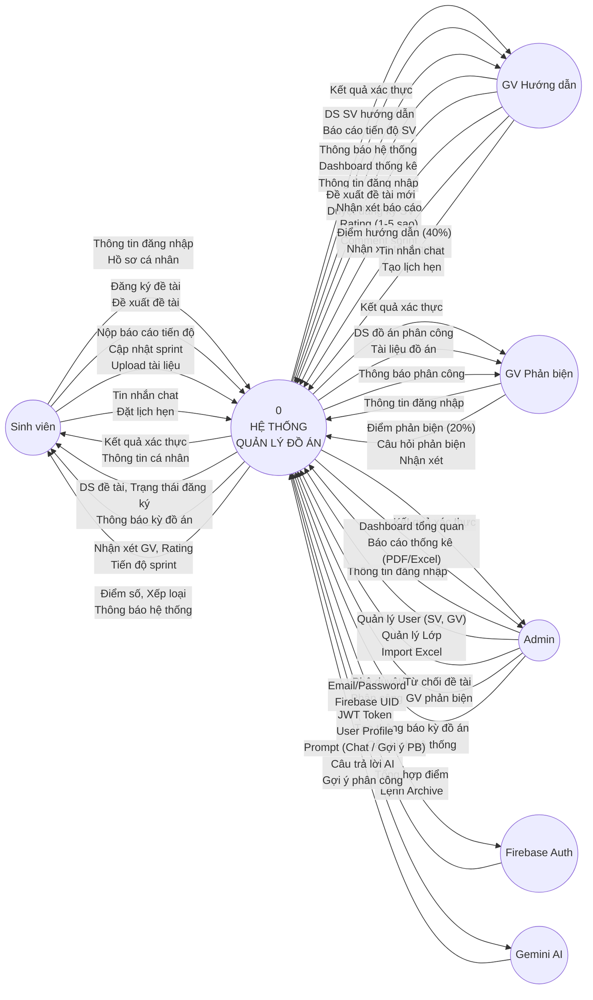
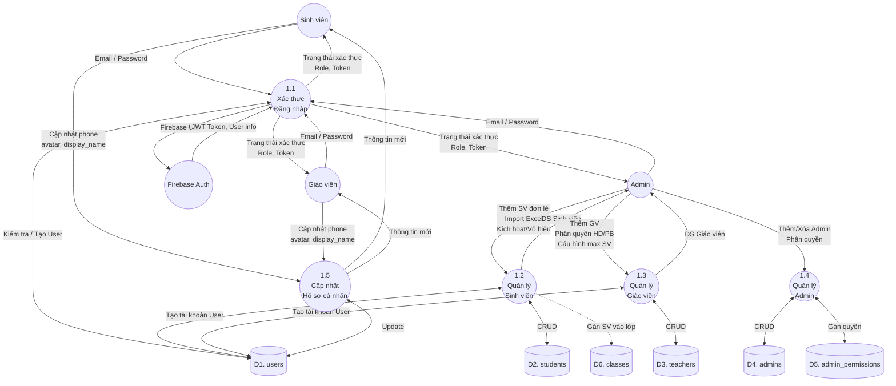
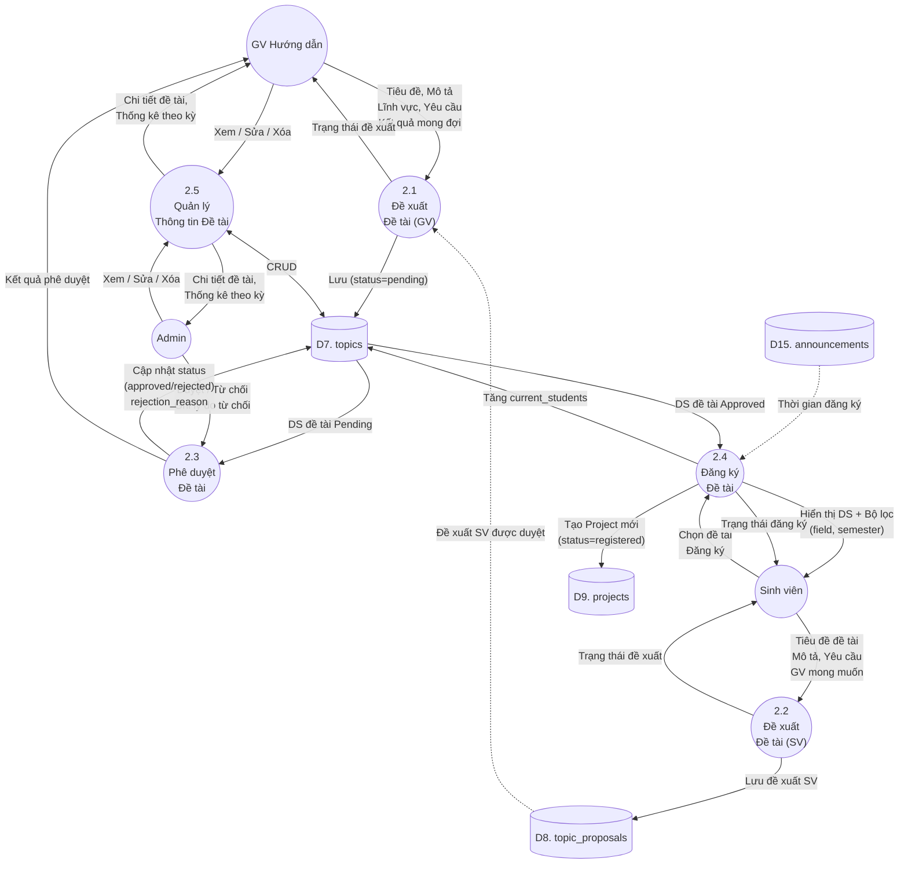
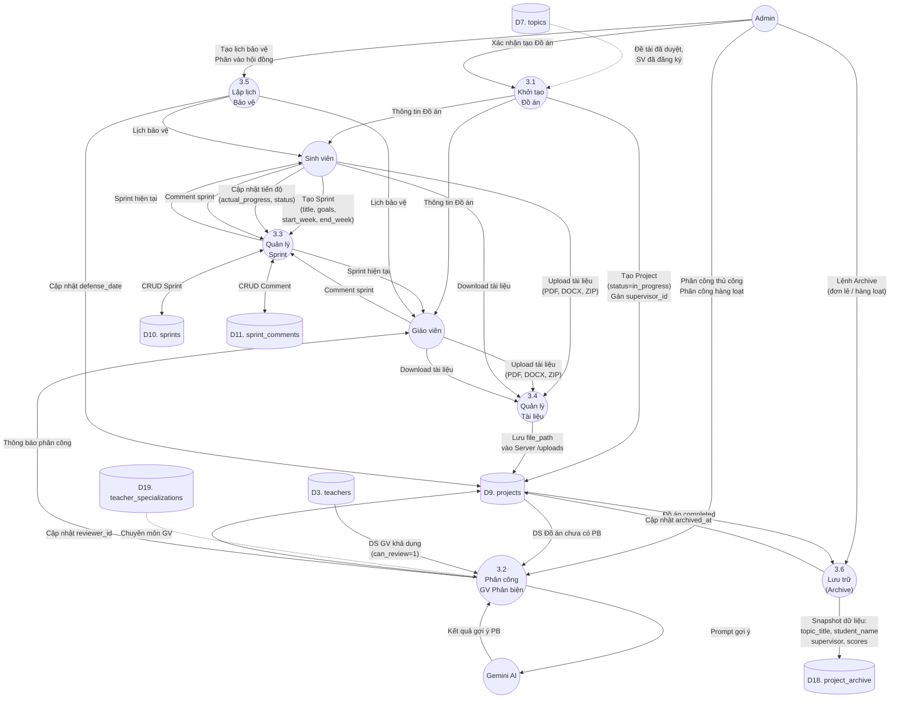
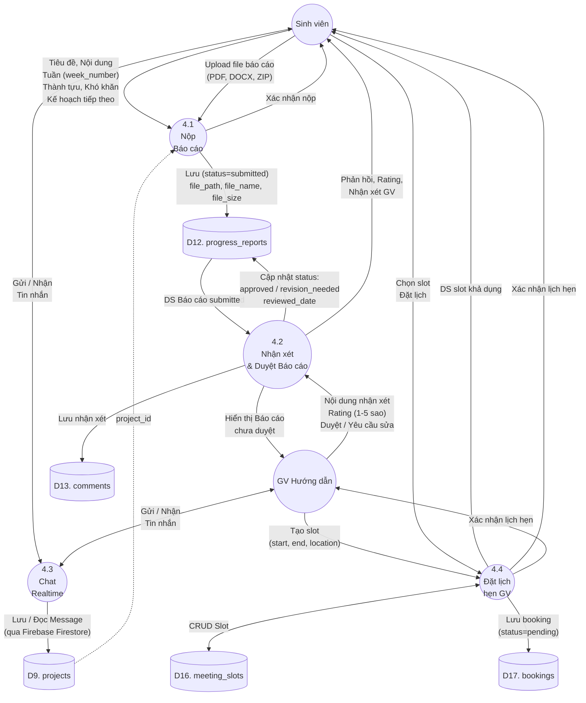
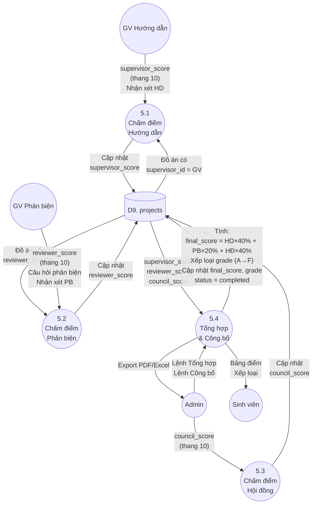
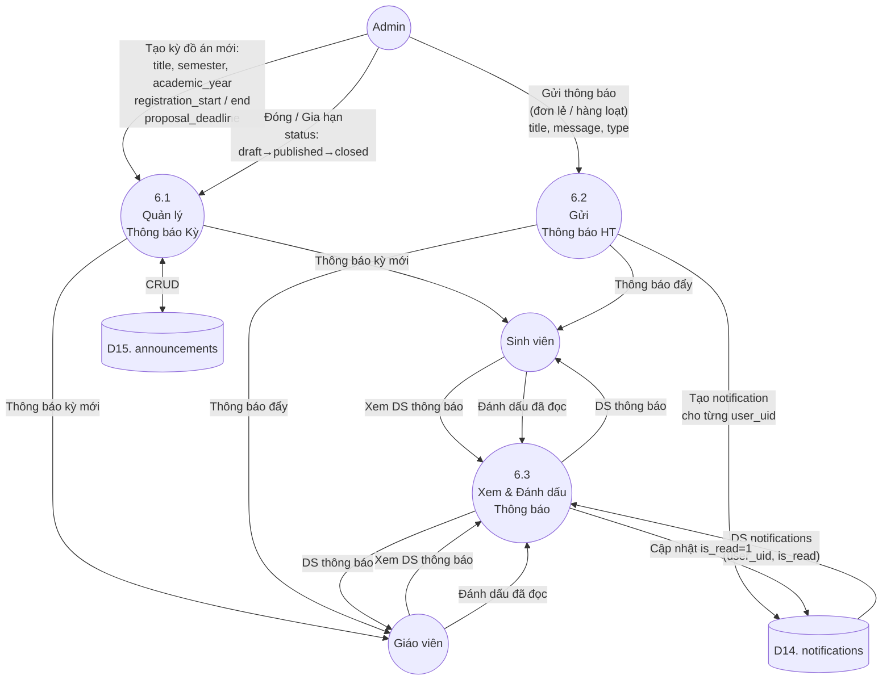
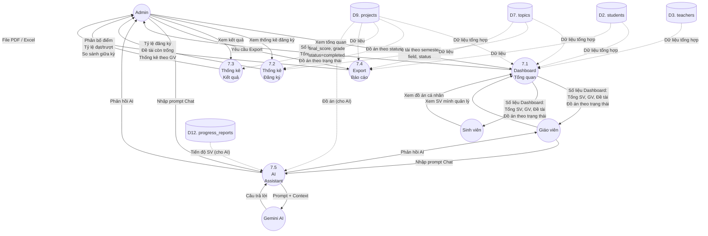
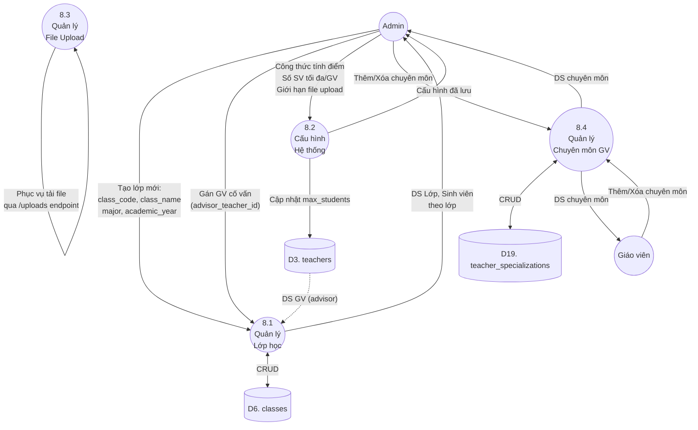

# Biểu Đồ Luồng Dữ Liệu (DFD) — Hệ Thống Quản Lý Đồ Án

Tài liệu mô tả **Data Flow Diagram (DFD)** qua 3 mức: **Mức 0** (Ngữ cảnh), **Mức 1** (Đỉnh), **Mức 2** (Dưới đỉnh) cho từng tiến trình.

> **Quy ước ký hiệu:**
> - `(( ))` = Thực thể ngoài (External Entity)
> - `((" "))` = Tiến trình (Process) — hình tròn
> - `[( )]` = Kho dữ liệu (Data Store) — hình trụ
> - `-->` = Luồng dữ liệu (Data Flow)
> - `-.->` = Luồng dữ liệu phụ / tham chiếu

---

## Danh Sách Kho Dữ Liệu (Data Stores)

Ánh xạ trực tiếp từ 16 bảng trong CSDL MySQL:

| Ký hiệu | Bảng (Table) | Mô tả |
|----------|-------------|-------|
| D1 | `users` | Thông tin tài khoản chung (id, uid, email, role, is_active) |
| D2 | `students` | Thông tin sinh viên (student_id, class_name, major) |
| D3 | `teachers` | Thông tin giáo viên (teacher_id, department, max_students, can_supervise, can_review) |
| D4 | `admins` | Thông tin quản trị viên |
| D5 | `admin_permissions` | Quyền hạn chi tiết của admin |
| D6 | `classes` | Danh sách lớp học (class_code, major, advisor_teacher_id) |
| D7 | `topics` | Đề tài đồ án (title, supervisor_id, reviewer_id, status, semester, field) |
| D8 | `topic_proposals` | Đề xuất đề tài từ sinh viên |
| D9 | `projects` | Đồ án (topic_id, student_id, supervisor_id, reviewer_id, status, scores, grade) |
| D10 | `sprints` | Sprint trong đồ án (sprint_number, goals, status, actual_progress) |
| D11 | `sprint_comments` | Nhận xét sprint (author_uid, content, author_role) |
| D12 | `progress_reports` | Báo cáo tiến độ (report_title, week_number, content, file_path, status) |
| D13 | `comments` | Nhận xét của GV về báo cáo (content, rating 1-5) |
| D14 | `notifications` | Thông báo hệ thống (title, message, type, is_read) |
| D15 | `announcements` | Thông báo kỳ đồ án (semester, registration_start/end, status) |
| D16 | `meeting_slots` | Lịch hẹn GV (start_time, end_time, location) |
| D17 | `bookings` | Đặt lịch hẹn SV (slot_id, student_id, status) |
| D18 | `project_archive` | Lưu trữ đồ án hoàn thành (final_score, grade, archived_at) |
| D19 | `teacher_specializations` | Chuyên môn giáo viên (specialization) |

---

## 1. DFD MỨC 0 — Biểu Đồ Ngữ Cảnh (Context Diagram)

Toàn bộ hệ thống được biểu diễn như **một tiến trình duy nhất** tương tác với các thực thể ngoài.

---

## 2. DFD MỨC 1 — Biểu Đồ Mức Đỉnh

Phân rã hệ thống thành **8 tiến trình** chính (tương ứng 8 nhóm chức năng BFD).

```mermaid
flowchart TD
    %% ═══ External Entities ═══
    SV((Sinh viên))
    GV((Giáo viên))
    AD((Admin))
    FA((Firebase Auth))
    AI((Gemini AI))

    %% ═══ Processes ═══
    P1(("1.0\nQuản lý\nNgười dùng"))
    P2(("2.0\nQuản lý\nĐề tài"))
    P3(("3.0\nQuản lý\nĐồ án"))
    P4(("4.0\nTheo dõi\nTiến độ"))
    P5(("5.0\nChấm điểm\n& Đánh giá"))
    P6(("6.0\nThông báo\n& Truyền thông"))
    P7(("7.0\nThống kê\n& Báo cáo"))
    P8(("8.0\nHệ thống\n& Hỗ trợ"))

    %% ═══ Data Stores ═══
    D1[(D1. users)]
    D2[(D2. students)]
    D3[(D3. teachers)]
    D4[(D4. admins)]
    D6[(D6. classes)]
    D7[(D7. topics)]
    D8[(D8. topic_proposals)]
    D9[(D9. projects)]
    D10[(D10. sprints)]
    D11[(D11. sprint_comments)]
    D12[(D12. progress_reports)]
    D13[(D13. comments)]
    D14[(D14. notifications)]
    D15[(D15. announcements)]
    D16[(D16. meeting_slots)]
    D17[(D17. bookings)]
    D18[(D18. project_archive)]
    D19[(D19. teacher_specializations)]

    %% ═══ 1.0 Quản lý Người dùng ═══
    SV & GV & AD -->|"Thông tin đăng nhập"| P1
    P1 -->|"Xác thực, Phân quyền"| SV & GV & AD
    P1 <-->|"CRUD User"| D1
    P1 <-->|"Thông tin SV"| D2
    P1 <-->|"Thông tin GV"| D3
    P1 <-->|"Thông tin Admin"| D4
    P1 -->|"Firebase UID"| FA
    FA -->|"JWT Token"| P1
    AD -->|"Import SV Excel"| P1

    %% ═══ 2.0 Quản lý Đề tài ═══
    GV -->|"Đề xuất đề tài"| P2
    SV -->|"Đề xuất đề tài SV"| P2
    AD -->|"Phê duyệt / Từ chối"| P2
    SV -->|"Đăng ký đề tài"| P2
    P2 -->|"DS đề tài, Trạng thái"| SV
    P2 <-->|"CRUD Đề tài"| D7
    P2 <-->|"Đề xuất SV"| D8
    D2 -.->|"Thông tin SV"| P2
    D3 -.->|"Thông tin GV"| P2

    %% ═══ 3.0 Quản lý Đồ án ═══
    D7 -.->|"Đề tài đã duyệt"| P3
    AD -->|"Phân công GV PB\nLập lịch bảo vệ"| P3
    P3 -->|"Thông tin Đồ án"| SV & GV
    P3 <-->|"CRUD Đồ án"| D9
    P3 <-->|"CRUD Sprint"| D10
    P3 <-->|"Comment Sprint"| D11
    P3 <-->|"Lưu trữ"| D18
    D3 -.->|"GV khả dụng"| P3
    D19 -.->|"Chuyên môn GV"| P3
    AI -.->|"Gợi ý phân công PB"| P3

    %% ═══ 4.0 Theo dõi Tiến độ ═══
    SV -->|"Nộp Báo cáo\nUpload file"| P4
    GV -->|"Nhận xét, Rating\nDuyệt Báo cáo"| P4
    SV & GV -->|"Tin nhắn Chat"| P4
    P4 -->|"Trạng thái tiến độ\nNhận xét GV"| SV
    P4 -->|"DS Báo cáo chưa duyệt"| GV
    P4 <-->|"CRUD Báo cáo"| D12
    P4 <-->|"CRUD Nhận xét"| D13
    D9 -.->|"Thông tin Đồ án"| P4

    %% ═══ 5.0 Chấm điểm ═══
    GV -->|"Điểm HD (40%)\nĐiểm PB (20%)\nNhận xét"| P5
    AD -->|"Điểm HĐ (40%)\nLệnh Tổng hợp"| P5
    P5 -->|"Điểm cuối, Xếp loại"| SV
    P5 <-->|"Cập nhật Score"| D9
    D9 -.->|"Đồ án cần chấm"| P5

    %% ═══ 6.0 Thông báo ═══
    AD -->|"Tạo Thông báo kỳ\nGửi hàng loạt"| P6
    P6 -->|"Thông báo"| SV & GV
    P6 <-->|"CRUD Thông báo"| D14
    P6 <-->|"CRUD Kỳ đồ án"| D15

    %% ═══ 7.0 Thống kê ═══
    AD & GV -->|"Yêu cầu Báo cáo"| P7
    P7 -->|"Dashboard, PDF/Excel"| AD & GV
    D9 -.->|"Dữ liệu Đồ án"| P7
    D7 -.->|"Dữ liệu Đề tài"| P7
    D2 -.->|"Dữ liệu SV"| P7
    GV -->|"Chat AI"| P7
    P7 -->|"Prompt"| AI
    AI -->|"Trả lời"| P7
    P7 -->|"Câu trả lời AI"| GV

    %% ═══ 8.0 Hệ thống ═══
    AD -->|"Quản lý Lớp\nCấu hình"| P8
    P8 <-->|"CRUD Lớp"| D6
    P8 <-->|"CRUD Lịch hẹn"| D16
    P8 <-->|"CRUD Đặt lịch"| D17
    P8 <-->|"Chuyên môn GV"| D19
    GV -->|"Tạo lịch hẹn"| P8
    SV -->|"Đặt lịch hẹn"| P8
    P8 -->|"Xác nhận lịch"| SV & GV
```

---

## 3. DFD MỨC 2 — Phân Rã Chi Tiết Từng Tiến Trình

### 3.1 Phân rã 1.0 — Quản lý Người Dùng

---

### 3.2 Phân rã 2.0 — Quản lý Đề Tài

---

### 3.3 Phân rã 3.0 — Quản lý Đồ Án

---

### 3.4 Phân rã 4.0 — Theo Dõi Tiến Độ

---

### 3.5 Phân rã 5.0 — Chấm Điểm & Đánh Giá

---

### 3.6 Phân rã 6.0 — Thông Báo & Truyền Thông

---

### 3.7 Phân rã 7.0 — Thống Kê & Báo Cáo

---

### 3.8 Phân rã 8.0 — Hệ Thống & Hỗ Trợ

---

## 4. Ma Trận Luồng Dữ Liệu — Tổng Hợp

### 4.1 Ma trận Thực thể → Tiến trình

| Thực thể | P1.0 | P2.0 | P3.0 | P4.0 | P5.0 | P6.0 | P7.0 | P8.0 |
|----------|:----:|:----:|:----:|:----:|:----:|:----:|:----:|:----:|
| **Sinh viên** | ✅ I/O | ✅ I/O | ✅ O | ✅ I/O | ✅ O | ✅ O | ✅ O | ✅ I |
| **GV Hướng dẫn** | ✅ I/O | ✅ I | ✅ I/O | ✅ I/O | ✅ I | ✅ O | ✅ I/O | ✅ I |
| **GV Phản biện** | ✅ I/O | — | ✅ O | — | ✅ I | ✅ O | — | — |
| **Admin** | ✅ I/O | ✅ I | ✅ I | — | ✅ I | ✅ I | ✅ I/O | ✅ I |
| **Firebase Auth** | ✅ I/O | — | — | — | — | — | — | — |
| **Gemini AI** | — | — | ✅ I/O | — | — | — | ✅ I/O | — |

> **I** = Input (gửi dữ liệu vào), **O** = Output (nhận dữ liệu ra), **I/O** = Cả hai chiều

### 4.2 Ma trận Tiến trình → Kho dữ liệu

| Kho dữ liệu | P1.0 | P2.0 | P3.0 | P4.0 | P5.0 | P6.0 | P7.0 | P8.0 |
|-------------|:----:|:----:|:----:|:----:|:----:|:----:|:----:|:----:|
| D1. users | R/W | R | — | — | — | — | — | — |
| D2. students | R/W | R | — | — | — | — | R | — |
| D3. teachers | R/W | R | R | — | — | — | R | R/W |
| D4. admins | R/W | — | — | — | — | — | — | — |
| D5. admin_permissions | R/W | — | — | — | — | — | — | — |
| D6. classes | R | — | — | — | — | — | — | R/W |
| D7. topics | — | R/W | R | — | — | — | R | — |
| D8. topic_proposals | — | R/W | — | — | — | — | — | — |
| D9. projects | — | W | R/W | R | R/W | — | R | — |
| D10. sprints | — | — | R/W | — | — | — | — | — |
| D11. sprint_comments | — | — | R/W | — | — | — | — | — |
| D12. progress_reports | — | — | — | R/W | — | — | R | — |
| D13. comments | — | — | — | R/W | — | — | — | — |
| D14. notifications | — | — | — | — | — | R/W | — | — |
| D15. announcements | — | — | — | — | — | R/W | — | — |
| D16. meeting_slots | — | — | — | R/W | — | — | — | R/W |
| D17. bookings | — | — | — | R/W | — | — | — | R/W |
| D18. project_archive | — | — | R/W | — | — | — | — | — |
| D19. teacher_specializations | — | — | R | — | — | — | — | R/W |

> **R** = Read, **W** = Write, **R/W** = Cả đọc và ghi
