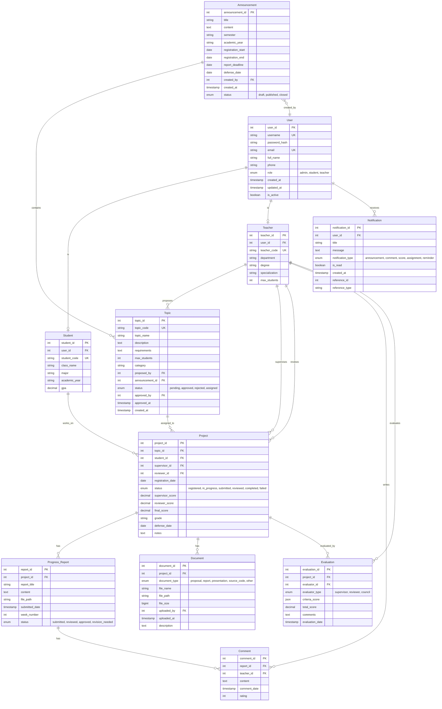

# Entity Relationship Diagram (ERD)

## Mô Tả Sơ Đồ ERD

```
                                    ┌─────────────┐
                                    │    User     │
                                    ├─────────────┤
                                    │ user_id PK  │
                                    │ username    │
                                    │ password    │
                                    │ email       │
                                    │ full_name   │
                                    │ role        │
                                    └──────┬──────┘
                                           │
                        ┌──────────────────┼──────────────────┐
                        │                  │                  │
                        │                  │                  │
                   ┌────▼────┐       ┌────▼────┐      ┌──────▼──────┐
                   │ Student │       │ Teacher │      │Notification │
                   ├─────────┤       ├─────────┤      ├─────────────┤
                   │ stud PK │       │ tea PK  │      │ notif_id PK │
                   │ user FK │       │ user FK │      │ user_id FK  │
                   │ code    │       │ code    │      │ message     │
                   │ class   │       │ dept    │      │ is_read     │
                   └────┬────┘       └────┬────┘      └─────────────┘
                        │                 │
                        │                 │
                        │            ┌────┴────┐
                        │            │         │
                        │       ┌────▼────┐    │
                        │       │  Topic  │    │
                        │       ├─────────┤    │
                        │       │ top PK  │    │
                        │       │ tea FK  │◄───┘ (proposed_by)
                        │       │ ann FK  │
                        │       │ name    │
                        │       │ status  │
                        │       └────┬────┘
                        │            │
                        │            │
                   ┌────▼────────────▼────┐
                   │      Project         │
                   ├──────────────────────┤
                   │ project_id PK        │
                   │ topic_id FK          │
                   │ student_id FK        │
                   │ supervisor_id FK ────┼───► Teacher (as supervisor)
                   │ reviewer_id FK ──────┼───► Teacher (as reviewer)
                   │ status               │
                   │ supervisor_score     │
                   │ reviewer_score       │
                   │ final_score          │
                   └──────────┬───────────┘
                              │
            ┌─────────────────┼─────────────────┐
            │                 │                 │
      ┌─────▼──────┐    ┌────▼────────┐  ┌────▼──────┐
      │ Progress   │    │  Document   │  │Evaluation │
      │  Report    │    ├─────────────┤  ├───────────┤
      ├────────────┤    │ doc_id PK   │  │ eval_id PK│
      │ report PK  │    │ proj_id FK  │  │ proj_id FK│
      │ proj_id FK │    │ file_path   │  │ teacher FK│
      │ content    │    │ type        │  │ score     │
      │ status     │    │ uploaded_by │  │ comments  │
      └─────┬──────┘    └─────────────┘  └───────────┘
            │
            │
      ┌─────▼──────┐
      │  Comment   │
      ├────────────┤
      │ comment PK │
      │ report FK  │
      │ teacher FK │
      │ content    │
      │ rating     │
      └────────────┘


      ┌──────────────┐
      │ Announcement │
      ├──────────────┤
      │ announ_id PK │
      │ title        │
      │ semester     │
      │ reg_start    │
      │ reg_end      │
      │ created_by FK├───► User
      │ status       │
      └──────┬───────┘
             │
             │ (1:N)
             │
        ┌────▼────┐
        │  Topic  │
        └─────────┘
```

## Cardinality (Lực Lượng)

### One-to-One (1:1)
- **User ──── Student**: Một user tương ứng với một student
- **User ──── Teacher**: Một user tương ứng với một teacher

### One-to-Many (1:N)
- **Announcement ──── Topic**: Một thông báo có nhiều đề tài
- **Teacher ──── Topic**: Một giáo viên đề xuất nhiều đề tài
- **Topic ──── Project**: Một đề tài có thể được nhiều sinh viên chọn (nếu max_students > 1)
- **Student ──── Project**: Một sinh viên có nhiều đồ án (qua các kỳ khác nhau)
- **Teacher ──── Project (supervisor)**: Một GV hướng dẫn nhiều đồ án
- **Teacher ──── Project (reviewer)**: Một GV phản biện nhiều đồ án
- **Project ──── Progress_Report**: Một đồ án có nhiều báo cáo tiến độ
- **Project ──── Document**: Một đồ án có nhiều tài liệu
- **Project ──── Evaluation**: Một đồ án có nhiều đánh giá
- **Progress_Report ──── Comment**: Một báo cáo có nhiều nhận xét
- **User ──── Notification**: Một user nhận nhiều thông báo

### Many-to-Many (N:M)
Không có quan hệ trực tiếp N:M trong thiết kế này, tất cả đã được chuyển về 1:N thông qua bảng trung gian (Project).

## Constraints (Ràng Buộc)

### Primary Keys
- Tất cả các bảng đều có primary key duy nhất, auto-increment

### Foreign Keys
- Tất cả foreign keys đều có ON DELETE và ON UPDATE rules:
  - User: ON DELETE CASCADE (khi xóa user, xóa tất cả dữ liệu liên quan)
  - Soft delete khuyến khích cho User (is_active = FALSE)

### Unique Constraints
- User: username, email
- Student: student_code
- Teacher: teacher_code
- Topic: topic_code

### Check Constraints
- Comment.rating: 1-5
- Project.supervisor_score, reviewer_score, final_score: 0-10
- Dates: registration_start < registration_end

### Business Constraints
```sql
-- Đảm bảo giáo viên phản biện khác giáo viên hướng dẫn
ALTER TABLE Project ADD CONSTRAINT chk_different_teachers
CHECK (supervisor_id != reviewer_id);

-- Đảm bảo điểm trong khoảng hợp lệ
ALTER TABLE Project ADD CONSTRAINT chk_score_range
CHECK (supervisor_score BETWEEN 0 AND 10 
   AND reviewer_score BETWEEN 0 AND 10
   AND final_score BETWEEN 0 AND 10);

-- Đảm bảo ngày đăng ký hợp lệ
ALTER TABLE Announcement ADD CONSTRAINT chk_dates
CHECK (registration_start < registration_end);
```

## Data Flow (Luồng Dữ Liệu)

### 1. Quy Trình Đăng Ký Đồ Án
```
Announcement (created) 
    ↓
Topic (proposed & approved)
    ↓
Project (student registers)
    ↓
Project (supervisor approves)
    ↓
Project (admin assigns reviewer)
```

### 2. Quy Trình Theo Dõi Tiến Độ
```
Project (in_progress)
    ↓
Progress_Report (submitted)
    ↓
Comment (teacher reviews)
    ↓
Notification (student notified)
```

### 3. Quy Trình Đánh Giá
```
Project (submitted)
    ↓
Document (uploaded)
    ↓
Evaluation (supervisor scores)
    ↓
Evaluation (reviewer scores)
    ↓
Project (final_score calculated)
    ↓
Notification (results published)
```

---

## ERD với Mermaid Diagram



---

## Detailed Table Relationships

### 1. User - Student/Teacher (Inheritance)
```
User (1) ──────── (1) Student
     (1) ──────── (1) Teacher
```
- **Type**: One-to-One (Optional)
- **Implementation**: Separate tables with FK
- **Constraint**: 
  - User.role xác định loại user
  - Student.user_id và Teacher.user_id UNIQUE
  - ON DELETE CASCADE

### 2. Announcement - Topic
```
Announcement (1) ──────── (N) Topic
```
- **Type**: One-to-Many
- **FK**: Topic.announcement_id → Announcement.announcement_id
- **Constraint**: 
  - ON DELETE RESTRICT (không xóa thông báo nếu có đề tài)
  - Topic phải thuộc về một thông báo

### 3. Teacher - Topic (Proposed By)
```
Teacher (1) ──────── (N) Topic
```
- **Type**: One-to-Many
- **FK**: Topic.proposed_by → Teacher.teacher_id
- **Constraint**: ON DELETE SET NULL

### 4. Topic - Project
```
Topic (1) ──────── (N) Project
```
- **Type**: One-to-Many
- **FK**: Project.topic_id → Topic.topic_id
- **Business Rule**: 
  - COUNT(Project per Topic) ≤ Topic.max_students
  - Topic.status must be 'approved'

### 5. Student - Project
```
Student (1) ──────── (N) Project
```
- **Type**: One-to-Many
- **FK**: Project.student_id → Student.student_id
- **Business Rule**: 
  - Một sinh viên chỉ 1 project active mỗi kỳ
  - Có thể có nhiều project qua các kỳ khác nhau

### 6. Teacher - Project (Two Relationships)
```
Teacher (1) ──────── (N) Project [as supervisor]
Teacher (1) ──────── (N) Project [as reviewer]
```
- **Type**: One-to-Many (Two FKs)
- **FK**: 
  - Project.supervisor_id → Teacher.teacher_id
  - Project.reviewer_id → Teacher.teacher_id
- **Constraint**: 
  - supervisor_id ≠ reviewer_id
  - COUNT(supervised) ≤ Teacher.max_students

### 7. Project - Progress_Report
```
Project (1) ──────── (N) Progress_Report
```
- **Type**: One-to-Many
- **FK**: Progress_Report.project_id → Project.project_id
- **Order**: week_number ASC
- **Constraint**: ON DELETE CASCADE

### 8. Progress_Report - Comment
```
Progress_Report (1) ──────── (N) Comment
```
- **Type**: One-to-Many
- **FK**: Comment.report_id → Progress_Report.report_id
- **Constraint**: ON DELETE CASCADE

### 9. Project - Document
```
Project (1) ──────── (N) Document
```
- **Type**: One-to-Many
- **FK**: Document.project_id → Project.project_id
- **Constraint**: ON DELETE CASCADE

### 10. Project - Evaluation
```
Project (1) ──────── (N) Evaluation
```
- **Type**: One-to-Many
- **FK**: Evaluation.project_id → Project.project_id
- **Business Rule**: Tối đa 2 evaluations (1 supervisor + 1 reviewer)

---

## Database Normalization Analysis

### Current Normal Forms

#### 1NF (First Normal Form) ✅
- Tất cả bảng có primary key
- Tất cả columns chứa atomic values
- Không có repeating groups
- Mỗi column chứa một loại dữ liệu duy nhất

#### 2NF (Second Normal Form) ✅
- Đáp ứng 1NF
- Không có partial dependencies
- Tất cả non-key attributes phụ thuộc hoàn toàn vào primary key
- Ví dụ: Student table, tất cả attributes phụ thuộc vào student_id

#### 3NF (Third Normal Form) ✅
- Đáp ứng 2NF
- Không có transitive dependencies
- Ví dụ: Teacher information không lưu trong Project, chỉ lưu FK

#### BCNF (Boyce-Codd Normal Form) ✅
- Đáp ứng 3NF
- Mọi determinant là candidate key
- Thiết kế hiện tại đáp ứng BCNF

### Denormalization Considerations

Có thể denormalize một số trường hợp để tăng performance:

```sql
-- Thêm cached fields vào Project table
ALTER TABLE Project ADD COLUMN (
    student_name VARCHAR(100),          -- Cache from Student
    supervisor_name VARCHAR(100),       -- Cache from Teacher
    topic_name VARCHAR(255),            -- Cache from Topic
    last_report_date DATE,              -- Cache from Progress_Report
    total_reports INT DEFAULT 0         -- Count cache
);

-- Thêm computed fields
ALTER TABLE Topic ADD COLUMN (
    registered_count INT DEFAULT 0,     -- COUNT(Project)
    available_slots INT                 -- max_students - registered_count
);
```

---

## Indexing Strategy

### Primary Indexes (Already Defined)
```sql
-- Tất cả PK tự động có index
-- user_id, student_id, teacher_id, project_id, etc.
```

### Foreign Key Indexes
```sql
-- User relationships
CREATE INDEX idx_student_user_id ON Student(user_id);
CREATE INDEX idx_teacher_user_id ON Teacher(user_id);
CREATE INDEX idx_notification_user_id ON Notification(user_id);

-- Project relationships
CREATE INDEX idx_project_topic_id ON Project(topic_id);
CREATE INDEX idx_project_student_id ON Project(student_id);
CREATE INDEX idx_project_supervisor_id ON Project(supervisor_id);
CREATE INDEX idx_project_reviewer_id ON Project(reviewer_id);

-- Progress Report relationships
CREATE INDEX idx_report_project_id ON Progress_Report(project_id);
CREATE INDEX idx_comment_report_id ON Comment(report_id);
CREATE INDEX idx_comment_teacher_id ON Comment(teacher_id);

-- Document relationships
CREATE INDEX idx_document_project_id ON Document(project_id);
CREATE INDEX idx_document_uploaded_by ON Document(uploaded_by);

-- Evaluation relationships
CREATE INDEX idx_evaluation_project_id ON Evaluation(project_id);
CREATE INDEX idx_evaluation_evaluator_id ON Evaluation(evaluator_id);

-- Topic relationships
CREATE INDEX idx_topic_proposed_by ON Topic(proposed_by);
CREATE INDEX idx_topic_announcement_id ON Topic(announcement_id);
```

### Composite Indexes (Performance Optimization)
```sql
-- Tìm project của student trong một kỳ cụ thể
CREATE INDEX idx_project_student_status 
ON Project(student_id, status);

-- Tìm đề tài theo announcement và status
CREATE INDEX idx_topic_announcement_status 
ON Topic(announcement_id, status);

-- Tìm báo cáo theo project và status
CREATE INDEX idx_report_project_status 
ON Progress_Report(project_id, status);

-- Tìm thông báo chưa đọc của user
CREATE INDEX idx_notification_user_read 
ON Notification(user_id, is_read, created_at DESC);

-- Tìm project cần phản biện
CREATE INDEX idx_project_status_reviewer 
ON Project(status, reviewer_id);

-- Query theo thời gian
CREATE INDEX idx_announcement_dates 
ON Announcement(registration_start, registration_end, status);

-- Search theo giáo viên và kỳ
CREATE INDEX idx_topic_teacher_announcement 
ON Topic(proposed_by, announcement_id, status);
```

### Full-Text Search Indexes
```sql
-- Tìm kiếm đề tài
CREATE FULLTEXT INDEX idx_topic_search 
ON Topic(topic_name, description);

-- Tìm kiếm thông báo
CREATE FULLTEXT INDEX idx_announcement_search 
ON Announcement(title, content);

-- Tìm kiếm báo cáo
CREATE FULLTEXT INDEX idx_report_search 
ON Progress_Report(report_title, content);
```

### Unique Indexes (Data Integrity)
```sql
CREATE UNIQUE INDEX idx_user_username ON User(username);
CREATE UNIQUE INDEX idx_user_email ON User(email);
CREATE UNIQUE INDEX idx_student_code ON Student(student_code);
CREATE UNIQUE INDEX idx_teacher_code ON Teacher(teacher_code);
CREATE UNIQUE INDEX idx_topic_code ON Topic(topic_code);

-- Đảm bảo một sinh viên chỉ một project mỗi announcement
CREATE UNIQUE INDEX idx_unique_student_announcement 
ON Project(student_id, (SELECT announcement_id FROM Topic WHERE topic_id = Project.topic_id));
```

---

## Sample Queries

### 1. Lấy danh sách đề tài có sẵn cho sinh viên
```sql
SELECT 
    t.topic_id,
    t.topic_code,
    t.topic_name,
    t.description,
    t.max_students,
    (t.max_students - COUNT(p.project_id)) AS available_slots,
    te.full_name AS supervisor_name,
    te.department,
    u.email AS supervisor_email
FROM Topic t
INNER JOIN Announcement a ON t.announcement_id = a.announcement_id
INNER JOIN Teacher te_rel ON t.proposed_by = te_rel.teacher_id
INNER JOIN User u ON te_rel.user_id = u.user_id
LEFT JOIN Project p ON t.topic_id = p.topic_id
WHERE 
    t.status = 'approved'
    AND a.status = 'published'
    AND CURDATE() BETWEEN a.registration_start AND a.registration_end
    AND (t.max_students - COUNT(p.project_id)) > 0
GROUP BY t.topic_id
ORDER BY t.created_at DESC;
```

### 2. Kiểm tra sinh viên có thể đăng ký không
```sql
SELECT 
    CASE 
        WHEN COUNT(*) > 0 THEN FALSE
        ELSE TRUE
    END AS can_register
FROM Project p
INNER JOIN Topic t ON p.topic_id = t.topic_id
INNER JOIN Announcement a ON t.announcement_id = a.announcement_id
WHERE 
    p.student_id = ?
    AND a.semester = (SELECT semester FROM Announcement WHERE announcement_id = ?)
    AND a.academic_year = (SELECT academic_year FROM Announcement WHERE announcement_id = ?);
```

### 3. Lấy tiến độ đồ án của sinh viên
```sql
SELECT 
    pr.report_id,
    pr.report_title,
    pr.week_number,
    pr.submitted_date,
    pr.status,
    COUNT(c.comment_id) AS comment_count,
    AVG(c.rating) AS avg_rating,
    MAX(c.comment_date) AS last_comment_date
FROM Progress_Report pr
LEFT JOIN Comment c ON pr.report_id = c.report_id
WHERE pr.project_id = ?
GROUP BY pr.report_id
ORDER BY pr.week_number ASC;
```

### 4. Dashboard giáo viên - Thống kê sinh viên hướng dẫn
```sql
SELECT 
    s.student_code,
    u.full_name,
    u.email,
    t.topic_name,
    p.status,
    COUNT(pr.report_id) AS total_reports,
    COUNT(CASE WHEN pr.status = 'submitted' THEN 1 END) AS pending_reviews,
    p.supervisor_score,
    DATEDIFF(CURDATE(), MAX(pr.submitted_date)) AS days_since_last_report
FROM Project p
INNER JOIN Student s ON p.student_id = s.student_id
INNER JOIN User u ON s.user_id = u.user_id
INNER JOIN Topic t ON p.topic_id = t.topic_id
LEFT JOIN Progress_Report pr ON p.project_id = pr.project_id
WHERE p.supervisor_id = ?
GROUP BY p.project_id
ORDER BY days_since_last_report DESC;
```

### 5. Tìm giáo viên phù hợp để phản biện
```sql
SELECT 
    te.teacher_id,
    u.full_name,
    te.specialization,
    te.department,
    COUNT(p_review.project_id) AS current_reviews,
    COUNT(p_supervise.project_id) AS current_supervisions,
    (COUNT(p_review.project_id) + COUNT(p_supervise.project_id)) AS total_workload
FROM Teacher te
INNER JOIN User u ON te.user_id = u.user_id
LEFT JOIN Project p_review ON te.teacher_id = p_review.reviewer_id 
    AND p_review.status IN ('submitted', 'reviewed')
LEFT JOIN Project p_supervise ON te.teacher_id = p_supervise.supervisor_id 
    AND p_supervise.status IN ('in_progress', 'submitted')
WHERE 
    te.teacher_id != ?  -- Not the supervisor
    AND te.specialization LIKE ?  -- Match topic category
GROUP BY te.teacher_id
HAVING total_workload < 10
ORDER BY total_workload ASC, current_reviews ASC
LIMIT 5;
```

### 6. Báo cáo thống kê theo kỳ
```sql
SELECT 
    a.semester,
    a.academic_year,
    COUNT(DISTINCT t.topic_id) AS total_topics,
    COUNT(DISTINCT CASE WHEN t.status = 'approved' THEN t.topic_id END) AS approved_topics,
    COUNT(DISTINCT p.project_id) AS total_registrations,
    COUNT(DISTINCT CASE WHEN p.status = 'completed' THEN p.project_id END) AS completed,
    COUNT(DISTINCT CASE WHEN p.status = 'failed' THEN p.project_id END) AS failed,
    AVG(p.final_score) AS average_score,
    COUNT(DISTINCT p.student_id) AS total_students,
    COUNT(DISTINCT p.supervisor_id) AS total_supervisors
FROM Announcement a
LEFT JOIN Topic t ON a.announcement_id = t.announcement_id
LEFT JOIN Project p ON t.topic_id = p.topic_id
WHERE a.announcement_id = ?
GROUP BY a.announcement_id;
```

### 7. Top sinh viên theo điểm
```sql
SELECT 
    s.student_code,
    u.full_name,
    s.class_name,
    s.major,
    t.topic_name,
    p.final_score,
    p.grade,
    te_sup.full_name AS supervisor_name
FROM Project p
INNER JOIN Student s ON p.student_id = s.student_id
INNER JOIN User u ON s.user_id = u.user_id
INNER JOIN Topic t ON p.topic_id = t.topic_id
INNER JOIN Teacher te_sup_rel ON p.supervisor_id = te_sup_rel.teacher_id
INNER JOIN User te_sup ON te_sup_rel.user_id = te_sup.user_id
INNER JOIN Announcement a ON t.announcement_id = a.announcement_id
WHERE 
    a.semester = ?
    AND a.academic_year = ?
    AND p.status = 'completed'
    AND p.final_score IS NOT NULL
ORDER BY p.final_score DESC
LIMIT 10;
```

---

## Views (Database Views)

### 1. View: Thông tin đầy đủ sinh viên
```sql
CREATE VIEW v_student_info AS
SELECT 
    s.student_id,
    s.student_code,
    u.user_id,
    u.username,
    u.email,
    u.full_name,
    u.phone,
    s.class_name,
    s.major,
    s.academic_year,
    s.gpa,
    u.is_active
FROM Student s
INNER JOIN User u ON s.user_id = u.user_id;
```

### 2. View: Thông tin đầy đủ giáo viên
```sql
CREATE VIEW v_teacher_info AS
SELECT 
    t.teacher_id,
    t.teacher_code,
    u.user_id,
    u.username,
    u.email,
    u.full_name,
    u.phone,
    t.department,
    t.degree,
    t.specialization,
    t.max_students,
    u.is_active
FROM Teacher t
INNER JOIN User u ON t.user_id = u.user_id;
```

### 3. View: Đồ án với thông tin đầy đủ
```sql
CREATE VIEW v_project_full AS
SELECT 
    p.project_id,
    p.registration_date,
    p.status AS project_status,
    p.defense_date,
    p.supervisor_score,
    p.reviewer_score,
    p.final_score,
    p.grade,
    -- Student info
    s.student_code,
    s.full_name AS student_name,
    s.email AS student_email,
    s.class_name,
    -- Topic info
    t.topic_code,
    t.topic_name,
    t.category,
    -- Supervisor info
    sup.teacher_code AS supervisor_code,
    sup.full_name AS supervisor_name,
    sup.email AS supervisor_email,
    sup.department AS supervisor_department,
    -- Reviewer info
    rev.teacher_code AS reviewer_code,
    rev.full_name AS reviewer_name,
    rev.email AS reviewer_email,
    -- Announcement info
    a.semester,
    a.academic_year
FROM Project p
INNER JOIN v_student_info s ON p.student_id = s.student_id
INNER JOIN Topic t ON p.topic_id = t.topic_id
INNER JOIN v_teacher_info sup ON p.supervisor_id = sup.teacher_id
LEFT JOIN v_teacher_info rev ON p.reviewer_id = rev.teacher_id
INNER JOIN Announcement a ON t.announcement_id = a.announcement_id;
```

### 4. View: Báo cáo tiến độ với nhận xét
```sql
CREATE VIEW v_progress_with_comments AS
SELECT 
    pr.report_id,
    pr.project_id,
    pr.report_title,
    pr.week_number,
    pr.submitted_date,
    pr.status AS report_status,
    COUNT(c.comment_id) AS comment_count,
    AVG(c.rating) AS avg_rating,
    MAX(c.comment_date) AS last_comment_date,
    GROUP_CONCAT(
        CONCAT(t.full_name, ': ', SUBSTRING(c.content, 1, 100))
        ORDER BY c.comment_date DESC
        SEPARATOR ' | '
    ) AS recent_comments
FROM Progress_Report pr
LEFT JOIN Comment c ON pr.report_id = c.report_id
LEFT JOIN v_teacher_info t ON c.teacher_id = t.teacher_id
GROUP BY pr.report_id;
```

### 5. View: Thống kê giáo viên
```sql
CREATE VIEW v_teacher_statistics AS
SELECT 
    t.teacher_id,
    t.teacher_code,
    t.full_name,
    t.department,
    t.max_students,
    -- Supervising
    COUNT(DISTINCT p_sup.project_id) AS supervising_count,
    COUNT(DISTINCT CASE 
        WHEN p_sup.status IN ('registered', 'in_progress') 
        THEN p_sup.project_id 
    END) AS active_supervising,
    AVG(CASE 
        WHEN p_sup.supervisor_score IS NOT NULL 
        THEN p_sup.supervisor_score 
    END) AS avg_supervisor_score,
    -- Reviewing
    COUNT(DISTINCT p_rev.project_id) AS reviewing_count,
    COUNT(DISTINCT CASE 
        WHEN p_rev.status IN ('submitted', 'reviewed') 
        THEN p_rev.project_id 
    END) AS active_reviewing,
    AVG(CASE 
        WHEN p_rev.reviewer_score IS NOT NULL 
        THEN p_rev.reviewer_score 
    END) AS avg_reviewer_score,
    -- Topics
    COUNT(DISTINCT tp.topic_id) AS proposed_topics,
    COUNT(DISTINCT CASE 
        WHEN tp.status = 'approved' 
        THEN tp.topic_id 
    END) AS approved_topics
FROM v_teacher_info t
LEFT JOIN Project p_sup ON t.teacher_id = p_sup.supervisor_id
LEFT JOIN Project p_rev ON t.teacher_id = p_rev.reviewer_id
LEFT JOIN Topic tp ON t.teacher_id = tp.proposed_by
GROUP BY t.teacher_id;
```

---

## Triggers

### 1. Trigger: Auto update available slots when project registered
```sql
DELIMITER //
CREATE TRIGGER trg_update_topic_slots_after_insert
AFTER INSERT ON Project
FOR EACH ROW
BEGIN
    UPDATE Topic
    SET registered_count = registered_count + 1,
        available_slots = max_students - (registered_count + 1)
    WHERE topic_id = NEW.topic_id;
END//
DELIMITER ;
```

### 2. Trigger: Calculate final score when both scores available
```sql
DELIMITER //
CREATE TRIGGER trg_calculate_final_score
BEFORE UPDATE ON Project
FOR EACH ROW
BEGIN
    IF NEW.supervisor_score IS NOT NULL AND NEW.reviewer_score IS NOT NULL THEN
        SET NEW.final_score = (NEW.supervisor_score * 0.7) + (NEW.reviewer_score * 0.3);
        
        -- Determine grade
        SET NEW.grade = CASE
            WHEN NEW.final_score >= 9.0 THEN 'A'
            WHEN NEW.final_score >= 8.5 THEN 'B+'
            WHEN NEW.final_score >= 8.0 THEN 'B'
            WHEN NEW.final_score >= 7.5 THEN 'C+'
            WHEN NEW.final_score >= 7.0 THEN 'C'
            WHEN NEW.final_score >= 6.5 THEN 'D+'
            WHEN NEW.final_score >= 6.0 THEN 'D'
            ELSE 'F'
        END;
        
        -- Update status
        IF NEW.final_score >= 6.0 THEN
            SET NEW.status = 'completed';
        ELSE
            SET NEW.status = 'failed';
        END IF;
    END IF;
END//
DELIMITER ;
```

### 3. Trigger: Create notification on new comment
```sql
DELIMITER //
CREATE TRIGGER trg_notify_on_comment
AFTER INSERT ON Comment
FOR EACH ROW
BEGIN
    DECLARE v_student_user_id INT;
    DECLARE v_project_id INT;
    
    -- Get student user_id from report
    SELECT p.student_id INTO v_project_id
    FROM Progress_Report pr
    INNER JOIN Project p ON pr.project_id = p.project_id
    WHERE pr.report_id = NEW.report_id;
    
    SELECT s.user_id INTO v_student_user_id
    FROM Project p
    INNER JOIN Student s ON p.student_id = s.student_id
    WHERE p.project_id = v_project_id;
    
    -- Insert notification
    INSERT INTO Notification (
        user_id, 
        title, 
        message, 
        notification_type, 
        reference_id, 
        reference_type
    ) VALUES (
        v_student_user_id,
        'Nhận xét mới từ giáo viên',
        CONCAT('Giáo viên đã nhận xét báo cáo của bạn. Rating: ', NEW.rating, '/5'),
        'comment',
        NEW.report_id,
        'progress_report'
    );
END//
DELIMITER ;
```

### 4. Trigger: Prevent over-assignment for teachers
```sql
DELIMITER //
CREATE TRIGGER trg_check_teacher_capacity
BEFORE INSERT ON Project
FOR EACH ROW
BEGIN
    DECLARE v_current_count INT;
    DECLARE v_max_students INT;
    
    SELECT COUNT(*), t.max_students 
    INTO v_current_count, v_max_students
    FROM Project p
    INNER JOIN Teacher t ON p.supervisor_id = t.teacher_id
    WHERE p.supervisor_id = NEW.supervisor_id
    AND p.status IN ('registered', 'in_progress')
    GROUP BY t.max_students;
    
    IF v_current_count >= v_max_students THEN
        SIGNAL SQLSTATE '45000'
        SET MESSAGE_TEXT = 'Giáo viên đã đạt số lượng sinh viên tối đa';
    END IF;
END//
DELIMITER ;
```

### 5. Trigger: Log status changes
```sql
-- First create audit table
CREATE TABLE Project_Audit (
    audit_id INT PRIMARY KEY AUTO_INCREMENT,
    project_id INT NOT NULL,
    old_status ENUM('registered', 'in_progress', 'submitted', 'reviewed', 'completed', 'failed'),
    new_status ENUM('registered', 'in_progress', 'submitted', 'reviewed', 'completed', 'failed'),
    changed_at TIMESTAMP DEFAULT CURRENT_TIMESTAMP,
    changed_by INT,
    notes TEXT
);

DELIMITER //
CREATE TRIGGER trg_audit_project_status
AFTER UPDATE ON Project
FOR EACH ROW
BEGIN
    IF OLD.status != NEW.status THEN
        INSERT INTO Project_Audit (
            project_id,
            old_status,
            new_status,
            notes
        ) VALUES (
            NEW.project_id,
            OLD.status,
            NEW.status,
            CONCAT('Status changed from ', OLD.status, ' to ', NEW.status)
        );
    END IF;
END//
DELIMITER ;
```

---

## Stored Procedures

### 1. Procedure: Register student to project
```sql
DELIMITER //
CREATE PROCEDURE sp_register_project(
    IN p_student_id INT,
    IN p_topic_id INT,
    OUT p_result VARCHAR(100),
    OUT p_project_id INT
)
BEGIN
    DECLARE v_announcement_id INT;
    DECLARE v_semester VARCHAR(20);
    DECLARE v_academic_year VARCHAR(20);
    DECLARE v_max_students INT;
    DECLARE v_current_count INT;
    DECLARE v_supervisor_id INT;
    DECLARE EXIT HANDLER FOR SQLEXCEPTION
    BEGIN
        ROLLBACK;
        SET p_result = 'ERROR: Đăng ký thất bại';
        SET p_project_id = NULL;
    END;
    
    START TRANSACTION;
    
    -- Get topic and announcement info
    SELECT 
        t.announcement_id, 
        t.max_students,
        t.proposed_by,
        a.semester,
        a.academic_year
    INTO 
        v_announcement_id, 
        v_max_students,
        v_supervisor_id,
        v_semester,
        v_academic_year
    FROM Topic t
    INNER JOIN Announcement a ON t.announcement_id = a.announcement_id
    WHERE t.topic_id = p_topic_id;
    
    -- Check if student already registered in this semester
    SELECT COUNT(*) INTO v_current_count
    FROM Project p
    INNER JOIN Topic t ON p.topic_id = t.topic_id
    INNER JOIN Announcement a ON t.announcement_id = a.announcement_id
    WHERE p.student_id = p_student_id
    AND a.semester = v_semester
    AND a.academic_year = v_academic_year;
    
    IF v_current_count > 0 THEN
        SET p_result = 'ERROR: Sinh viên đã đăng ký đồ án trong kỳ này';
        ROLLBACK;
    ELSE
        -- Check if topic has available slots
        SELECT COUNT(*) INTO v_current_count
        FROM Project
        WHERE topic_id = p_topic_id;
        
        IF v_current_count >= v_max_students THEN
            SET p_result = 'ERROR: Đề tài đã hết slot';
            ROLLBACK;
        ELSE
            -- Register project
            INSERT INTO Project (
                topic_id,
                student_id,
                supervisor_id,
                registration_date,
                status
            ) VALUES (
                p_topic_id,
                p_student_id,
                v_supervisor_id,
                CURDATE(),
                'registered'
            );
            
            SET p_project_id = LAST_INSERT_ID();
            SET p_result = 'SUCCESS';
            COMMIT;
        END IF;
    END IF;
END//
DELIMITER ;
```

### 2. Procedure: Assign reviewer
```sql
DELIMITER //
CREATE PROCEDURE sp_assign_reviewer(
    IN p_project_id INT,
    IN p_reviewer_id INT,
    OUT p_result VARCHAR(100)
)
BEGIN
    DECLARE v_supervisor_id INT;
    DECLARE EXIT HANDLER FOR SQLEXCEPTION
    BEGIN
        ROLLBACK;
        SET p_result = 'ERROR: Phân công thất bại';
    END;
    
    START TRANSACTION;
    
    -- Get supervisor
    SELECT supervisor_id INTO v_supervisor_id
    FROM Project
    WHERE project_id = p_project_id;
    
    -- Check if reviewer is different from supervisor
    IF v_supervisor_id = p_reviewer_id THEN
        SET p_result = 'ERROR: Giáo viên phản biện trùng với giáo viên hướng dẫn';
        ROLLBACK;
    ELSE
        -- Update project
        UPDATE Project
        SET reviewer_id = p_reviewer_id
        WHERE project_id = p_project_id;
        
        -- Create notification
        INSERT INTO Notification (
            user_id,
            title,
            message,
            notification_type,
            reference_id,
            reference_type
        )
        SELECT 
            u.user_id,
            'Phân công phản biện',
            'Bạn được phân công phản biện đồ án',
            'assignment',
            p_project_id,
            'project'
        FROM Teacher t
        INNER JOIN User u ON t.user_id = u.user_id
        WHERE t.teacher_id = p_reviewer_id;
        
        SET p_result = 'SUCCESS';
        COMMIT;
    END IF;
END//
DELIMITER ;
```

---

## Data Migration Considerations

### 1. Initial Data Setup
```sql
-- Insert default admin
INSERT INTO User (username, password_hash, email, full_name, role)
VALUES ('admin', SHA2('admin123', 256), 'admin@university.edu.vn', 'System Administrator', 'admin');

-- Insert sample departments
-- Insert sample semesters
```

### 2. Historical Data Import
- Import existing student records
- Import existing teacher records  
- Import past projects and scores
- Maintain referential integrity

### 3. Backup Strategy
- Daily incremental backups
- Weekly full backups
- Transaction log backups every hour
- Test restore procedures regularly
