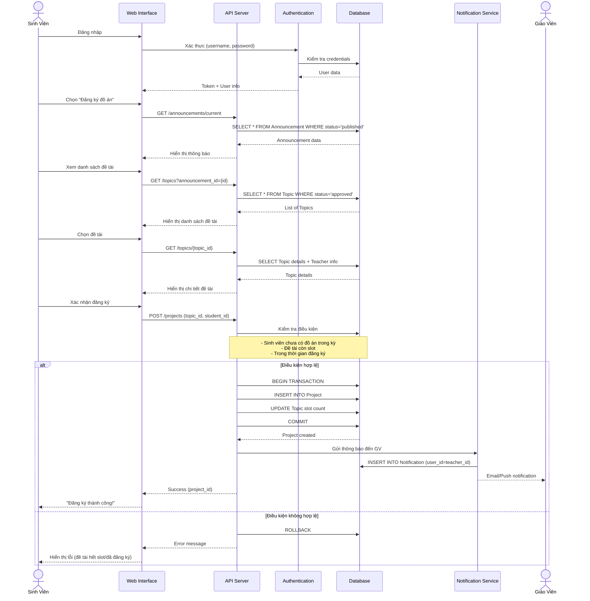
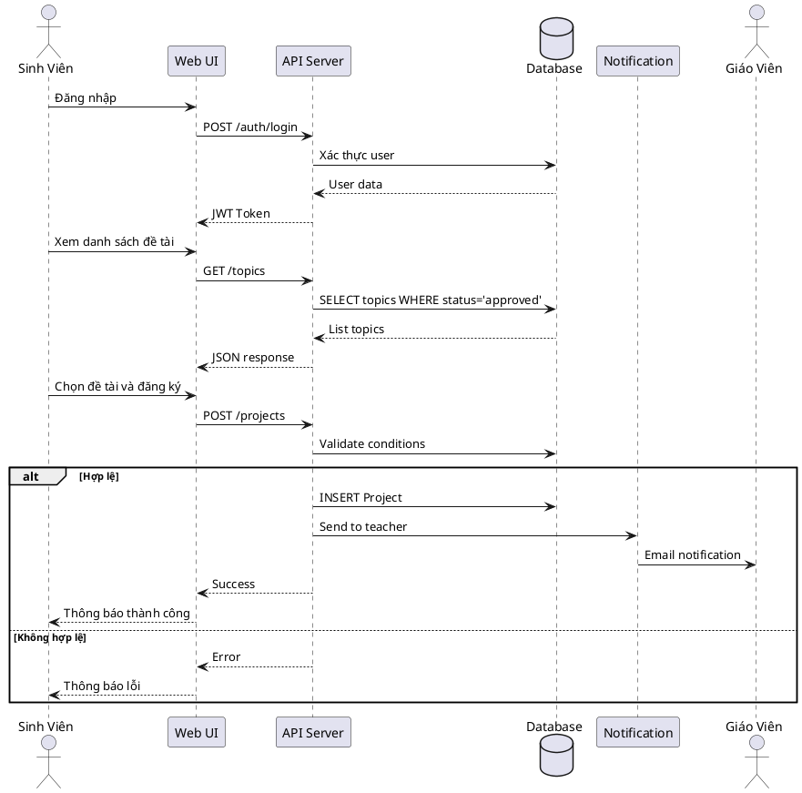
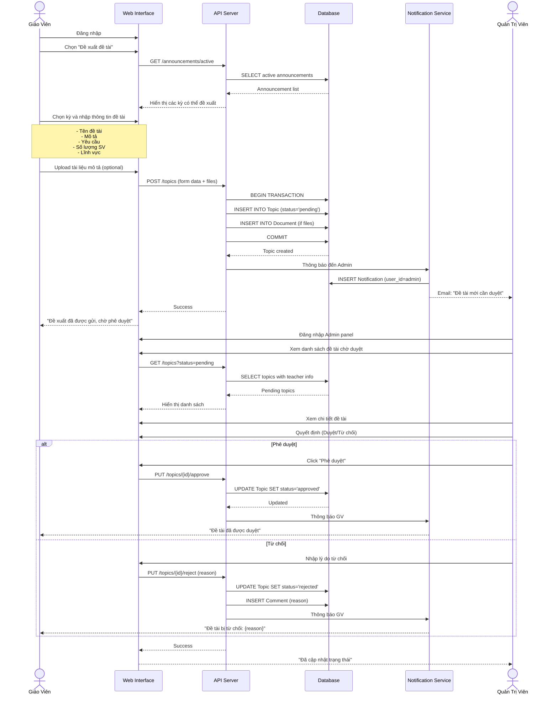
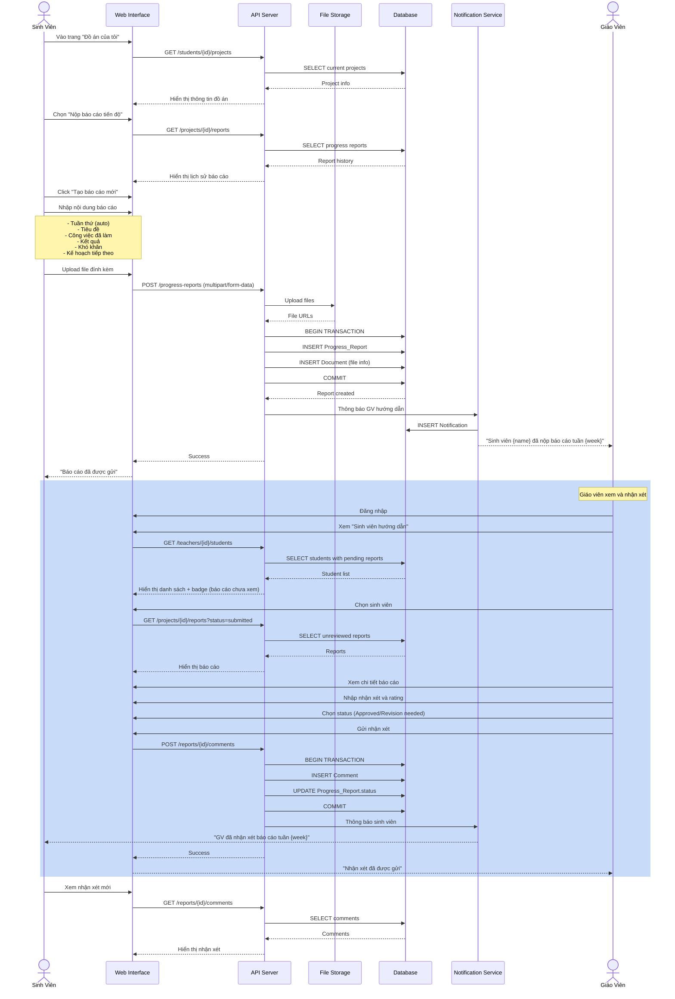
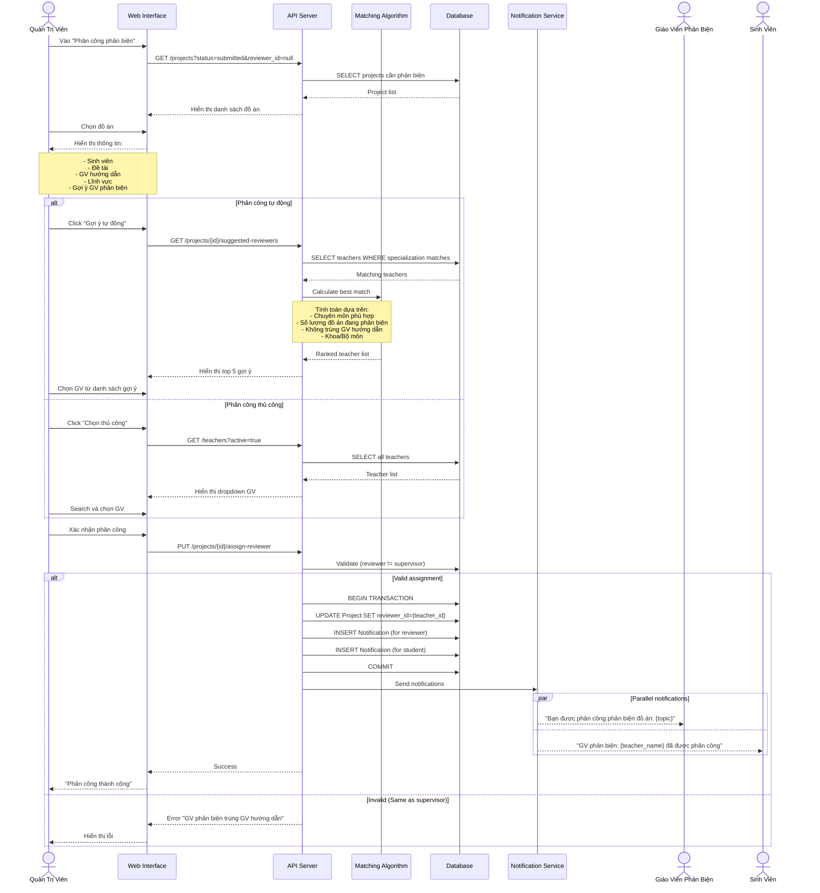
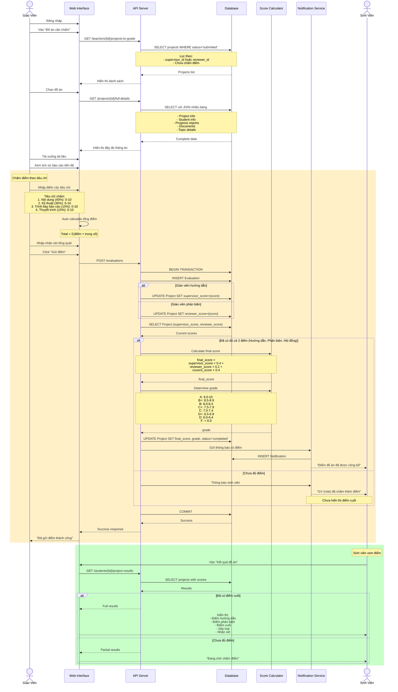
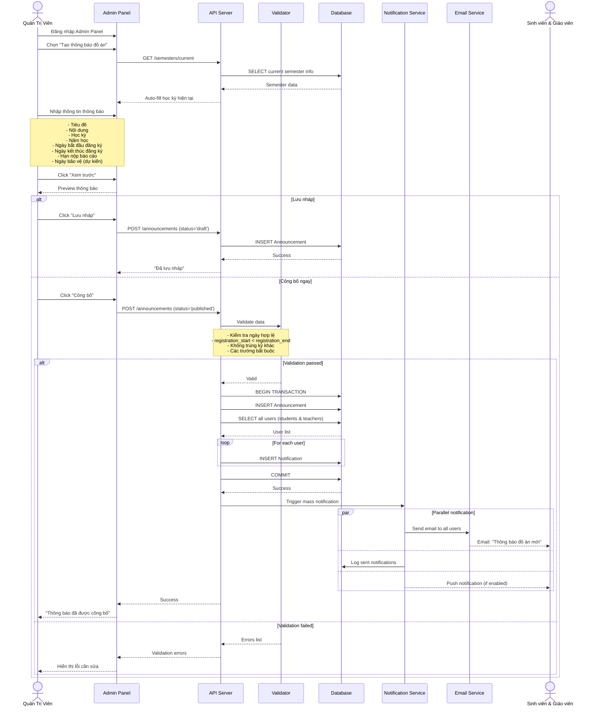
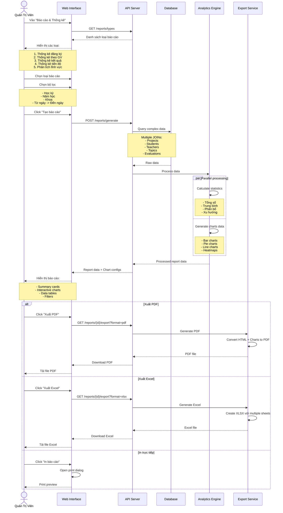

# Sequence Diagrams - Hệ Thống Quản Lý Đồ Án

## 1. Sequence Diagram: Đăng Ký Đồ Án

### Mô tả
Sinh viên xem và đăng ký đề tài đồ án sau khi nhà trường công bố thông báo

### Mermaid Diagram

### PlantUML Format

---

## 2. Sequence Diagram: Đề Xuất và Phê Duyệt Đề Tài

### Mô tả
Giáo viên đề xuất đề tài mới và Admin phê duyệt

---

## 3. Sequence Diagram: Nộp và Nhận Xét Báo Cáo Tiến Độ

### Mô tả
Sinh viên nộp báo cáo tiến độ, Giáo viên hướng dẫn xem và nhận xét

---

## 4. Sequence Diagram: Phân Công Giáo Viên Phản Biện

### Mô tả
Admin phân công giáo viên phản biện cho các đồ án đã hoàn thành

---

## 5. Sequence Diagram: Chấm Điểm Đồ Án

### Mô tả
Giáo viên hướng dẫn và phản biện chấm điểm, hệ thống tính điểm cuối

---

## 6. Sequence Diagram: Tạo Thông Báo Đồ Án

### Mô tả
Admin tạo và công bố thông báo đồ án cho học kỳ mới

---

## 7. Sequence Diagram: Báo Cáo Thống Kê

### Mô tả
Admin tạo và xuất báo cáo thống kê về đồ án

---

## Các Thành Phần Chính

### 1. Actors (Tác Nhân)
- **Sinh Viên**: Người sử dụng chính, đăng ký và thực hiện đồ án
- **Giáo Viên Hướng Dẫn**: Đề xuất đề tài, hướng dẫn và chấm điểm
- **Giáo Viên Phản Biện**: Đánh giá và chấm điểm phản biện
- **Quản Trị Viên**: Quản lý hệ thống, phê duyệt, phân công

### 2. Systems (Hệ Thống)
- **Web Interface**: Giao diện người dùng (Frontend)
- **API Server**: Xử lý logic nghiệp vụ (Backend)
- **Database**: Lưu trữ dữ liệu
- **Authentication**: Xác thực và phân quyền
- **Notification Service**: Gửi thông báo
- **File Storage**: Lưu trữ tài liệu
- **Email Service**: Gửi email
- **Analytics Engine**: Phân tích và báo cáo

### 3. Key Patterns

#### Transaction Pattern
Sử dụng BEGIN TRANSACTION - COMMIT/ROLLBACK cho:
- Đăng ký đồ án (cập nhật nhiều bảng)
- Chấm điểm (cập nhật điểm và trạng thái)
- Phê duyệt đề tài

#### Notification Pattern
Sau các action quan trọng, gửi thông báo đến các user liên quan:
- Real-time notification (WebSocket/SSE)
- Email notification
- Push notification

#### Validation Pattern
Kiểm tra điều kiện nghiệp vụ trước khi thực hiện:
- Điều kiện thời gian
- Điều kiện quyền hạn
- Điều kiện số lượng

#### Parallel Processing
Xử lý song song khi có thể:
- Gửi thông báo đến nhiều user
- Tính toán thống kê
- Generate reports

---

## Notes về Implementation

### 1. Error Handling
Mỗi API call cần xử lý:
- Network errors
- Validation errors
- Business logic errors
- Database errors

### 2. Security
- Xác thực JWT token ở mọi request
- Kiểm tra quyền truy cập (Authorization)
- Validate input data
- Prevent SQL injection

### 3. Performance
- Caching cho data không thay đổi thường xuyên
- Pagination cho danh sách lớn
- Lazy loading cho tài liệu
- Async processing cho email/notification

### 4. Monitoring
- Log tất cả các action quan trọng
- Track error rate
- Monitor response time
- Alert khi có vấn đề
