# Use Case Diagram - Hệ Thống Quản Lý Đồ Án (Visual)

## 1. PlantUML Diagram (Detailed)

### Cách xem:
1. Install PlantUML extension trong VS Code
2. Mở file `USE_CASE_DIAGRAM_VISUAL.puml`
3. Press Alt+D để preview

### Hoặc copy code dưới đây vào: https://www.plantuml.com/plantuml/uml/

```plantuml
@startuml
!theme plain

' Define actors
actor "Sinh Viên" as Student #lightblue
actor "Giáo Viên Hướng Dẫn" as Supervisor #lightgreen  
actor "Giáo Viên Phản Biện" as Reviewer #lightpink
actor "Quản Trị Viên" as Admin #lightyellow

' Define generalization
:Giáo Viên: as Teacher
Supervisor -up-|> Teacher
Reviewer -up-|> Teacher

rectangle "Hệ Thống Quản Lý Đồ Án" {
    
    ' Common
    (Đăng nhập) as Login
    (Đăng xuất) as Logout
    (Xem thông báo) as ViewNotif
    
    ' Student use cases
    package "Chức năng Sinh Viên" #DDFFDD {
        (Xem thông báo đồ án) as UC01
        (Xem danh sách đề tài) as UC02
        (Đăng ký đồ án) as UC03
        (Đề xuất đề tài mới) as UC04
        (Nộp báo cáo tiến độ) as UC05
        (Xem nhận xét GV) as UC06
        (Upload tài liệu) as UC07
        (Xem điểm) as UC08
    }
    
    ' Supervisor use cases
    package "Chức năng GV Hướng Dẫn" #FFDDDD {
        (Đề xuất đề tài) as UC10
        (Duyệt SV đăng ký) as UC11
        (Xem SV hướng dẫn) as UC12
        (Theo dõi tiến độ) as UC13
        (Nhận xét báo cáo) as UC14
        (Chấm điểm hướng dẫn) as UC15
    }
    
    ' Reviewer use cases
    package "Chức năng GV Phản Biện" #DDDDFF {
        (Xem đồ án phân công) as UC20
        (Xem tài liệu đồ án) as UC21
        (Chấm điểm phản biện) as UC22
        (Nhận xét đánh giá) as UC23
    }
    
    ' Admin use cases  
    package "Chức năng Quản Trị" #FFFFDD {
        (Tạo thông báo đồ án) as UC30
        (Phê duyệt đề tài) as UC31
        (Phân công phản biện) as UC32
        (Quản lý tiến độ) as UC33
        (Tổng hợp điểm) as UC34
        (Báo cáo thống kê) as UC35
        (Quản lý người dùng) as UC36
    }
    
    ' System use cases
    package "Hệ thống" #DDDDDD {
        (Gửi thông báo) as SYS01
        (Gửi email) as SYS02
        (Tính điểm tự động) as SYS03
        (Sao lưu dữ liệu) as SYS04
    }
}

' Student relationships
Student --> Login
Student --> UC01
Student --> UC02
Student --> UC03
Student --> UC05
Student --> UC06
Student --> UC08
Student --> ViewNotif

' Supervisor relationships
Supervisor --> Login
Supervisor --> UC10
Supervisor --> UC11
Supervisor --> UC12
Supervisor --> UC13
Supervisor --> UC14
Supervisor --> UC15
Supervisor --> ViewNotif

' Reviewer relationships
Reviewer --> Login
Reviewer --> UC20
Reviewer --> UC21
Reviewer --> UC22
Reviewer --> UC23
Reviewer --> ViewNotif

' Admin relationships
Admin --> Login
Admin --> UC30
Admin --> UC31
Admin --> UC32
Admin --> UC33
Admin --> UC34
Admin --> UC35
Admin --> UC36
Admin --> ViewNotif

' Include relationships
UC03 ..> Login : <<include>>
UC03 ..> UC02 : <<include>>
UC05 ..> Login : <<include>>
UC14 ..> Login : <<include>>
UC15 ..> Login : <<include>>
UC22 ..> Login : <<include>>
UC30 ..> SYS01 : <<include>>
UC31 ..> SYS01 : <<include>>
UC32 ..> SYS01 : <<include>>
SYS01 ..> SYS02 : <<include>>
UC15 ..> SYS03 : <<include>>
UC22 ..> SYS03 : <<include>>

' Extend relationships
UC04 ..> UC03 : <<extend>>
UC07 ..> UC05 : <<extend>>
UC23 ..> UC22 : <<extend>>

@enduml
```



---

## 2. Mermaid Diagram (For GitHub/VS Code)

```mermaid
graph TB
    subgraph Actors
        Student[👨‍🎓 Sinh Viên]
        Supervisor[👨‍🏫 GV Hướng Dẫn]
        Reviewer[👨‍🏫 GV Phản Biện]
        Admin[👨‍💼 Quản Trị Viên]
    end
    
    subgraph "Hệ Thống Quản Lý Đồ Án"
        subgraph "Common"
            UC00[UC-00: Đăng nhập]
            UC40[UC-40: Hệ thống thông báo]
        end
        
        subgraph "Chức năng Sinh Viên"
            UC01[UC-01: Xem thông báo đồ án]
            UC02[UC-02: Xem danh sách đề tài]
            UC03[UC-03: Đăng ký đồ án]
            UC04[UC-04: Đề xuất đề tài mới]
            UC05[UC-05: Nộp báo cáo tiến độ]
            UC06[UC-06: Xem nhận xét từ GV]
            UC07[UC-07: Upload tài liệu]
            UC08[UC-08: Xem điểm đánh giá]
        end
        
        subgraph "Chức năng GV Hướng Dẫn"
            UC10[UC-10: Đề xuất đề tài]
            UC11[UC-11: Duyệt SV đăng ký]
            UC12[UC-12: Xem danh sách SV]
            UC13[UC-13: Theo dõi tiến độ SV]
            UC14[UC-14: Nhận xét báo cáo]
            UC15[UC-15: Chấm điểm hướng dẫn]
        end
        
        subgraph "Chức năng GV Phản Biện"
            UC20[UC-20: Xem đồ án được phân công]
            UC21[UC-21: Xem tài liệu đồ án]
            UC22[UC-22: Chấm điểm phản biện]
            UC23[UC-23: Nhận xét đánh giá]
        end
        
        subgraph "Chức năng Quản Trị"
            UC30[UC-30: Tạo thông báo đồ án]
            UC31[UC-31: Phê duyệt đề tài]
            UC32[UC-32: Phân công phản biện]
            UC33[UC-33: Quản lý tiến độ chung]
            UC34[UC-34: Tổng hợp điểm]
            UC35[UC-35: Báo cáo thống kê]
            UC36[UC-36: Quản lý người dùng]
        end
    end
    
    %% Student connections
    Student --> UC00
    Student --> UC01
    Student --> UC02
    Student --> UC03
    Student --> UC05
    Student --> UC06
    Student --> UC07
    Student --> UC08
    
    %% Supervisor connections
    Supervisor --> UC00
    Supervisor --> UC10
    Supervisor --> UC11
    Supervisor --> UC12
    Supervisor --> UC13
    Supervisor --> UC14
    Supervisor --> UC15
    
    %% Reviewer connections
    Reviewer --> UC00
    Reviewer --> UC20
    Reviewer --> UC21
    Reviewer --> UC22
    Reviewer --> UC23
    
    %% Admin connections
    Admin --> UC00
    Admin --> UC30
    Admin --> UC31
    Admin --> UC32
    Admin --> UC33
    Admin --> UC34
    Admin --> UC35
    Admin --> UC36
    
    %% Include relationships
    UC03 -.->|include| UC02
    UC03 -.->|include| UC00
    UC30 -.->|include| UC40
    UC31 -.->|include| UC40
    UC32 -.->|include| UC40
    
    %% Extend relationships
    UC04 -.->|extend| UC03
    UC07 -.->|extend| UC05
    UC23 -.->|extend| UC22
    
    style Student fill:#e1f5ff
    style Supervisor fill:#d4edda
    style Reviewer fill:#f8d7da
    style Admin fill:#fff3cd
```



---

## 3. Draw.io / Lucidchart Format

### ASCII Art Representation

```
┌─────────────────────────────────────────────────────────────────────────────┐
│                    HỆ THỐNG QUẢN LÝ ĐỒ ÁN SINH VIÊN                        │
└─────────────────────────────────────────────────────────────────────────────┘

     👨‍🎓 Sinh Viên                    👨‍🏫 GV Hướng Dẫn
          │                                │
          │                                │
    ┌─────┴─────┐                    ┌─────┴─────┐
    │           │                    │           │
    ▼           ▼                    ▼           ▼
┌───────┐   ┌───────┐            ┌───────┐   ┌───────┐
│ UC-01 │   │ UC-02 │            │ UC-10 │   │ UC-11 │
│ Xem   │   │ Xem   │            │ Đề    │   │ Duyệt │
│ thông │   │ danh  │            │ xuất  │   │ SV    │
│ báo   │   │ sách  │            │ đề tài│   │       │
└───┬───┘   └───┬───┘            └───────┘   └───────┘
    │           │                      
    │       ┌───▼───┐                  
    │       │ UC-03 │ ◄────┐           
    │       │ Đăng  │      │ extend    
    │       │ ký    │      │           
    │       │ đồ án │  ┌───┴───┐       
    │       └───┬───┘  │ UC-04 │       
    │           │      │ Đề    │       
    │           │      │ xuất  │       
    │           │      │ mới   │       
    │           │      └───────┘       
    │           │                      
    │       ┌───▼───┐                  
    │       │ UC-05 │                  
    │       │ Nộp   │                  
    │       │ báo   │                  
    │       │ cáo   │                  
    │       └───┬───┘                  
    │           │                      
    │       ┌───▼───┐                  
    │       │ UC-06 │                  
    │       │ Xem   │                  
    │       │ nhận  │                  
    │       │ xét   │                  
    │       └───────┘                  
    │                                  
    │       ┌───────┐                  
    └──────►│ UC-08 │                  
            │ Xem   │                  
            │ điểm  │                  
            └───────┘                  

     👨‍🏫 GV Phản Biện              👨‍💼 Quản Trị Viên
          │                                │
          │                                │
    ┌─────┴─────┐                    ┌─────┴─────┐
    │           │                    │           │
    ▼           ▼                    ▼           ▼
┌───────┐   ┌───────┐            ┌───────┐   ┌───────┐
│ UC-20 │   │ UC-21 │            │ UC-30 │   │ UC-31 │
│ Xem   │   │ Xem   │            │ Tạo   │   │ Phê   │
│ đồ án │   │ tài   │            │ thông │   │ duyệt │
│ phân  │   │ liệu  │            │ báo   │   │ đề tài│
│ công  │   │       │            └───┬───┘   └───────┘
└───────┘   └───┬───┘                │
                │                    │
            ┌───▼───┐                ▼
            │ UC-22 │            ┌───────┐
            │ Chấm  │            │ UC-32 │
            │ điểm  │            │ Phân  │
            │ phản  │            │ công  │
            │ biện  │            │ phản  │
            └───┬───┘            │ biện  │
                │ ◄──────┐       └───┬───┘
                │ extend │           │
            ┌───┴───┐    │           ▼
            │ UC-23 ├────┘       ┌───────┐
            │ Nhận  │            │ UC-33 │
            │ xét   │            │ Quản  │
            └───────┘            │ lý    │
                                 │ tiến  │
                                 │ độ    │
                                 └───┬───┘
                                     │
                                     ▼
                                 ┌───────┐
                                 │ UC-35 │
                                 │ Báo   │
                                 │ cáo   │
                                 │ thống │
                                 │ kê    │
                                 └───────┘
```

---

## 4. Use Case Relationship Matrix

| Use Case | Student | Supervisor | Reviewer | Admin | Include | Extend |
|----------|---------|------------|----------|-------|---------|--------|
| **UC-00: Đăng nhập** | ✓ | ✓ | ✓ | ✓ | - | - |
| **UC-01: Xem thông báo** | ✓ | | | | UC-00 | - |
| **UC-02: Xem đề tài** | ✓ | | | | UC-00 | - |
| **UC-03: Đăng ký đồ án** | ✓ | | | | UC-00, UC-02 | UC-04 |
| **UC-04: Đề xuất mới** | ✓ | | | | - | UC-03 |
| **UC-05: Nộp báo cáo** | ✓ | | | | UC-00 | UC-07 |
| **UC-06: Xem nhận xét** | ✓ | | | | UC-00 | - |
| **UC-07: Upload tài liệu** | ✓ | | | | - | UC-05 |
| **UC-08: Xem điểm** | ✓ | | | | UC-00 | - |
| **UC-10: Đề xuất đề tài** | | ✓ | | | UC-00 | - |
| **UC-11: Duyệt SV** | | ✓ | | | UC-00 | - |
| **UC-12: Xem SV hướng dẫn** | | ✓ | | | UC-00 | - |
| **UC-13: Theo dõi tiến độ** | | ✓ | | | UC-00 | - |
| **UC-14: Nhận xét báo cáo** | | ✓ | | | UC-00 | - |
| **UC-15: Chấm điểm HD** | | ✓ | | | UC-00 | - |
| **UC-20: Xem đồ án** | | | ✓ | | UC-00 | - |
| **UC-21: Xem tài liệu** | | | ✓ | | UC-00 | - |
| **UC-22: Chấm điểm PB** | | | ✓ | | UC-00 | UC-23 |
| **UC-23: Nhận xét** | | | ✓ | | - | UC-22 |
| **UC-30: Tạo thông báo** | | | | ✓ | UC-00, UC-40 | - |
| **UC-31: Phê duyệt** | | | | ✓ | UC-00, UC-40 | - |
| **UC-32: Phân công** | | | | ✓ | UC-00, UC-40 | - |
| **UC-33: Quản lý tiến độ** | | | | ✓ | UC-00 | - |
| **UC-34: Tổng hợp điểm** | | | | ✓ | UC-00 | - |
| **UC-35: Báo cáo** | | | | ✓ | UC-00 | - |
| **UC-36: Quản lý user** | | | | ✓ | UC-00 | - |
| **UC-40: Gửi thông báo** | System | System | System | System | UC-41 | - |
| **UC-41: Gửi email** | System | System | System | System | - | - |

---

## 5. Color Coding Legend

### Actor Colors:
- 🔵 **Sinh Viên** (Student) - Light Blue (#e1f5ff)
- 🟢 **Giáo Viên Hướng Dẫn** (Supervisor) - Light Green (#d4edda)
- 🔴 **Giáo Viên Phản Biện** (Reviewer) - Light Red (#f8d7da)
- 🟡 **Quản Trị Viên** (Admin) - Light Yellow (#fff3cd)

### Use Case Package Colors:
- 🟨 **Chức năng Sinh Viên** - Yellow (#DDFFDD)
- 🟥 **Chức năng GV Hướng Dẫn** - Red (#FFDDDD)
- 🟦 **Chức năng GV Phản Biện** - Blue (#DDDDFF)
- 🟧 **Chức năng Quản Trị** - Orange (#FFFFDD)
- ⬜ **Hệ thống** - Gray (#DDDDDD)

---

## 6. Use Case Dependencies Graph

```
                    ┌──────────┐
                    │  UC-00   │
                    │ Đăng nhập │
                    └────┬─────┘
                         │
         ┌───────────────┼───────────────┐
         │               │               │
    ┌────▼────┐     ┌────▼────┐    ┌────▼────┐
    │  UC-03  │     │  UC-05  │    │  UC-15  │
    │ Đăng ký │     │  Nộp BC │    │ Chấm HD │
    └────┬────┘     └────┬────┘    └─────────┘
         │               │
    ┌────▼────┐     ┌────▼────┐
    │  UC-02  │     │  UC-07  │
    │  Xem DT │     │ Upload  │
    └─────────┘     └─────────┘
         │
    ┌────▼────┐
    │  UC-04  │
    │Đề xuất  │
    └─────────┘

Include: ──────►
Extend:  - - - ►
```

---

## 7. Interaction Flow

### Flow 1: Đăng ký đồ án (Student)
```
Student → UC-00 (Login)
       ↓
Student → UC-01 (View Announcement)
       ↓
Student → UC-02 (View Topics)
       ↓
Student → UC-03 (Register Project)
       │
       ├──→ UC-04 (Propose New Topic) [Optional/Extend]
       │
       ↓
System → UC-40 (Send Notification to Supervisor)
```

### Flow 2: Chấm điểm (Supervisor & Reviewer)
```
Supervisor/Reviewer → UC-00 (Login)
                   ↓
            UC-12/UC-20 (View Assigned Projects)
                   ↓
            UC-21 (View Documents)
                   ↓
            UC-15/UC-22 (Grade Project)
                   │
                   ├──→ UC-23 (Add Comments) [Optional/Extend]
                   │
                   ↓
            System → Calculate Final Score
                   ↓
            System → UC-40 (Notify Student)
```

### Flow 3: Quản lý hệ thống (Admin)
```
Admin → UC-00 (Login)
      ↓
Admin → UC-30 (Create Announcement)
      ↓
System → UC-40 (Notify All Users)
      ↓
Admin → UC-31 (Approve Topics)
      ↓
System → UC-40 (Notify Teachers)
      ↓
Admin → UC-32 (Assign Reviewers)
      ↓
System → UC-40 (Notify Reviewers & Students)
```

---

## 8. Use Case Priority Matrix

| Priority | Use Cases | Description |
|----------|-----------|-------------|
| **Critical (Must Have)** | UC-00, UC-03, UC-10, UC-15, UC-22, UC-30, UC-31 | Core functionality |
| **High (Should Have)** | UC-01, UC-02, UC-05, UC-11, UC-13, UC-14, UC-32 | Important features |
| **Medium (Could Have)** | UC-04, UC-06, UC-07, UC-12, UC-33, UC-34, UC-35 | Nice to have |
| **Low (Won't Have - Phase 1)** | UC-36, UC-23, UC-08 (partial) | Future enhancements |

---

## 9. System Boundary Note

```
╔═══════════════════════════════════════════════════════════╗
║         SYSTEM BOUNDARY - HỆ THỐNG QUẢN LÝ ĐỒ ÁN         ║
╠═══════════════════════════════════════════════════════════╣
║                                                           ║
║  INSIDE SYSTEM:                                          ║
║  • All use cases (UC-00 to UC-41)                       ║
║  • Database                                              ║
║  • Business logic                                        ║
║  • Notification system                                   ║
║                                                           ║
║  OUTSIDE SYSTEM (External):                             ║
║  • Email service (Gmail, SendGrid)                      ║
║  • File storage (Cloud storage)                         ║
║  • Authentication service (OAuth - optional)             ║
║  • Backup service                                        ║
║                                                           ║
╚═══════════════════════════════════════════════════════════╝
```

---

## 10. Hướng dẫn sử dụng

### Để xem Use Case Diagram:

1. **PlantUML** (Recommended):
   - Install extension: `PlantUML` by jebbs
   - Mở file `.puml`
   - Press `Alt + D` để preview

2. **Mermaid** (GitHub/VS Code):
   - File markdown tự động render trong GitHub
   - Install extension `Markdown Preview Mermaid Support` cho VS Code

3. **Online Tools**:
   - PlantUML: https://www.plantuml.com/plantuml/uml/
   - Draw.io: https://app.diagrams.net/
   - Lucidchart: https://www.lucidchart.com/

4. **Export**:
   - PlantUML có thể export sang PNG, SVG, PDF
   - Mermaid có thể export sang PNG, SVG từ VS Code

---

## Tổng kết

✅ **36 Use Cases** được định nghĩa  
✅ **4 Actors** chính  
✅ **3 loại relationships**: Association, Include, Extend  
✅ **5 packages** chức năng  
✅ Có thể render bằng nhiều công cụ khác nhau  
✅ Tài liệu đầy đủ, chi tiết, sẵn sàng cho implementation
