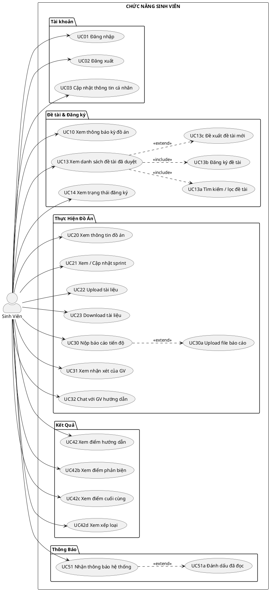
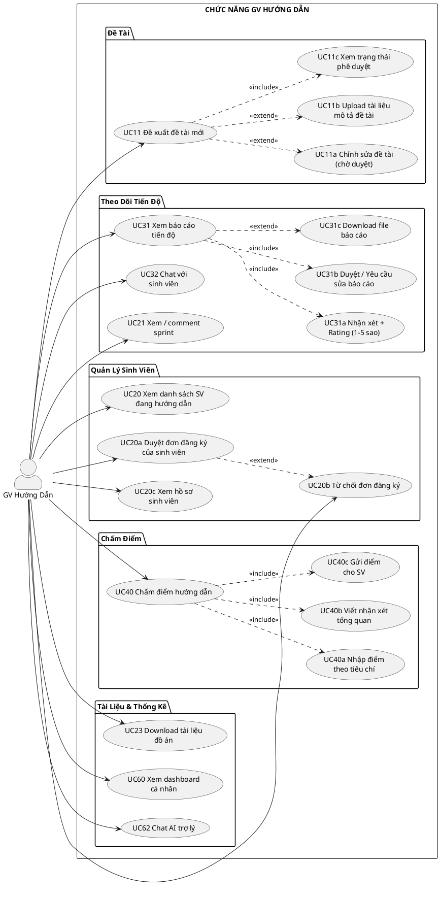
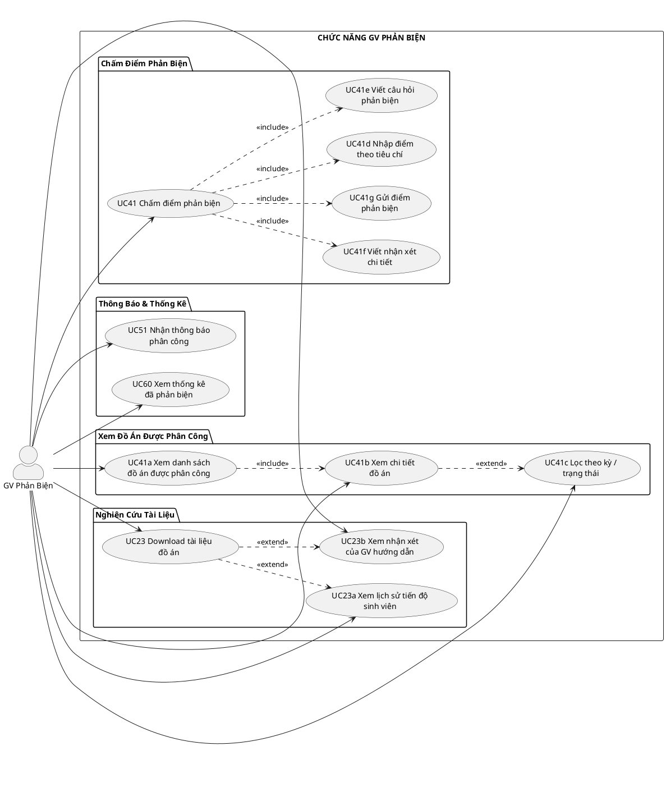
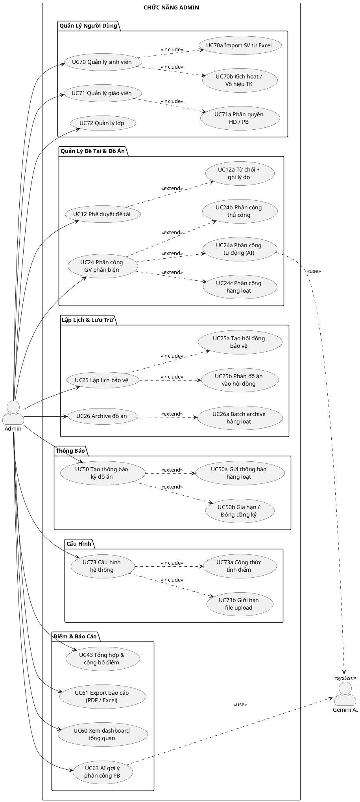
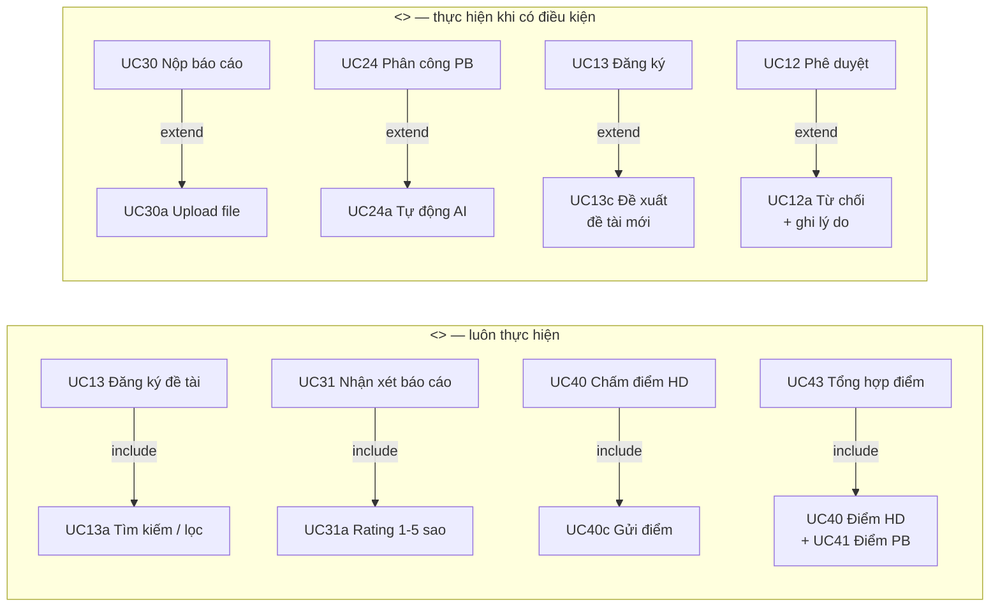

# Biểu Đồ Use Case — Hệ Thống Quản Lý Đồ Án

---

## 1. Tổng Quan Actors

| Actor | Mô tả |
|-------|-------|
| **Student** | Sinh viên thực hiện đồ án |
| **Supervisor** | Giáo viên hướng dẫn |
| **Reviewer** | Giáo viên phản biện |
| **Admin** | Quản trị viên hệ thống |
| **Firebase Auth** | Hệ thống xác thực (External) |
| **Gemini AI** | Trợ lý AI (External) |

---

## 2. Biểu Đồ Use Case Tổng Quan

```plantuml
@startuml USE_CASE_OVERVIEW

skinparam actorStyle awesome
skinparam packageStyle rectangle
skinparam usecase {
  BackgroundColor #EEF4FF
  BorderColor #2563eb
  ArrowColor #374151
  ActorBorderColor #1e3a5f
  ActorFontColor #1e3a5f
}

left to right direction

actor "Sinh Viên\n(Student)" as SV
actor "GV Hướng Dẫn\n(Supervisor)" as GVHD
actor "GV Phản Biện\n(Reviewer)" as GVPB
actor "Quản Trị Viên\n(Admin)" as AD
actor "Firebase Auth" as FA <<system>>
actor "Gemini AI" as AI <<system>>

rectangle "HỆ THỐNG QUẢN LÝ ĐỒ ÁN" {

  package "Xác thực" {
    usecase "UC01\nĐăng nhập" as UC01
    usecase "UC02\nĐăng xuất" as UC02
    usecase "UC03\nCập nhật\nthông tin cá nhân" as UC03
  }

  package "Quản lý Đề Tài" {
    usecase "UC10\nXem thông báo\nkỳ đồ án" as UC10
    usecase "UC11\nĐề xuất đề tài" as UC11
    usecase "UC12\nPhê duyệt đề tài" as UC12
    usecase "UC13\nĐăng ký đề tài" as UC13
    usecase "UC14\nHủy đăng ký\nđề tài" as UC14
  }

  package "Quản lý Đồ Án" {
    usecase "UC20\nXem đồ án\ncủa mình" as UC20
    usecase "UC21\nQuản lý Sprint" as UC21
    usecase "UC22\nUpload tài liệu" as UC22
    usecase "UC23\nDownload tài liệu" as UC23
    usecase "UC24\nPhân công\nGV phản biện" as UC24
    usecase "UC25\nLập lịch\nbảo vệ" as UC25
    usecase "UC26\nArchive đồ án" as UC26
  }

  package "Theo Dõi Tiến Độ" {
    usecase "UC30\nNộp báo cáo\ntiến độ" as UC30
    usecase "UC31\nNhận xét\nbáo cáo" as UC31
    usecase "UC32\nChat realtime\nvới GV HD" as UC32
  }

  package "Chấm Điểm" {
    usecase "UC40\nChấm điểm\nhướng dẫn" as UC40
    usecase "UC41\nChấm điểm\nphản biện" as UC41
    usecase "UC42\nXem điểm\ncủa mình" as UC42
    usecase "UC43\nTổng hợp &\ncông bố điểm" as UC43
  }

  package "Thông Báo" {
    usecase "UC50\nTạo thông báo\nđồ án" as UC50
    usecase "UC51\nNhận thông báo\nhệ thống" as UC51
  }

  package "Thống Kê & AI" {
    usecase "UC60\nXem dashboard\nthống kê" as UC60
    usecase "UC61\nExport báo cáo\n(PDF / Excel)" as UC61
    usecase "UC62\nChat AI\ntrợ lý" as UC62
    usecase "UC63\nGợi ý phân công\nGV phản biện (AI)" as UC63
  }

  package "Quản Trị" {
    usecase "UC70\nQuản lý\nsinh viên" as UC70
    usecase "UC71\nQuản lý\ngiáo viên" as UC71
    usecase "UC72\nQuản lý lớp" as UC72
    usecase "UC73\nCấu hình\nhệ thống" as UC73
  }
}

' ── Student ──
SV --> UC01
SV --> UC02
SV --> UC03
SV --> UC10
SV --> UC13
SV --> UC14
SV --> UC20
SV --> UC21
SV --> UC22
SV --> UC23
SV --> UC30
SV --> UC32
SV --> UC42
SV --> UC51
SV --> UC60

' ── Supervisor ──
GVHD --> UC01
GVHD --> UC02
GVHD --> UC03
GVHD --> UC10
GVHD --> UC11
GVHD --> UC20
GVHD --> UC21
GVHD --> UC22
GVHD --> UC23
GVHD --> UC31
GVHD --> UC32
GVHD --> UC40
GVHD --> UC51
GVHD --> UC60
GVHD --> UC62

' ── Reviewer ──
GVPB --> UC01
GVPB --> UC02
GVPB --> UC23
GVPB --> UC41
GVPB --> UC51
GVPB --> UC60

' ── Admin ──
AD --> UC01
AD --> UC02
AD --> UC12
AD --> UC24
AD --> UC25
AD --> UC26
AD --> UC43
AD --> UC50
AD --> UC51
AD --> UC60
AD --> UC61
AD --> UC63
AD --> UC70
AD --> UC71
AD --> UC72
AD --> UC73

' ── External Systems ──
UC01 ..> FA : <<use>>
UC62 ..> AI : <<use>>
UC63 ..> AI : <<use>>

' ── include / extend ──
UC13 ..> UC10 : <<include>>
UC30 ..> UC22 : <<extend>>
UC40 ..> UC43 : <<include>>
UC41 ..> UC43 : <<include>>
UC63 ..> UC24 : <<extend>>

@enduml
```



---

## 3. Biểu Đồ Use Case Chi Tiết — Từng Actor

### 3.1 Student (Sinh viên)



---

### 3.2 Supervisor — GV Hướng Dẫn



---

### 3.3 Reviewer — GV Phản Biện



---

### 3.4 Admin — Quản Trị Viên



---

## 4. Bảng Danh Sách Use Case

| ID | Tên Use Case | Actor chính | Mức độ |
|----|-------------|-------------|--------|
| UC01 | Đăng nhập | Tất cả | Cao |
| UC02 | Đăng xuất | Tất cả | Thấp |
| UC03 | Cập nhật thông tin cá nhân | Tất cả | Thấp |
| UC10 | Xem thông báo kỳ đồ án | SV, GVHD | Trung bình |
| UC11 | Đề xuất đề tài mới | GVHD, SV | Cao |
| UC12 | Phê duyệt đề tài | Admin | Cao |
| UC13 | Đăng ký đề tài | SV | Cao |
| UC14 | Xem trạng thái đăng ký | SV | Thấp |
| UC20 | Xem thông tin đồ án | SV, GVHD | Trung bình |
| UC21 | Quản lý sprint | SV, GVHD | Trung bình |
| UC22 | Upload tài liệu | SV, GVHD | Trung bình |
| UC23 | Download tài liệu | SV, GVHD, GVPB | Trung bình |
| UC24 | Phân công GV phản biện | Admin | Cao |
| UC25 | Lập lịch bảo vệ | Admin | Trung bình |
| UC26 | Archive đồ án | Admin | Thấp |
| UC30 | Nộp báo cáo tiến độ | SV | Cao |
| UC31 | Nhận xét báo cáo tiến độ | GVHD | Cao |
| UC32 | Chat realtime | SV, GVHD | Trung bình |
| UC40 | Chấm điểm hướng dẫn (40%) | GVHD | Cao |
| UC41 | Chấm điểm phản biện (20%) | GVPB | Cao |
| UC42 | Xem điểm của mình | SV | Trung bình |
| UC43 | Tổng hợp & công bố điểm | Admin | Cao |
| UC50 | Tạo thông báo kỳ đồ án | Admin | Cao |
| UC51 | Nhận thông báo hệ thống | Tất cả | Thấp |
| UC60 | Xem dashboard thống kê | Tất cả | Trung bình |
| UC61 | Export báo cáo (PDF/Excel) | Admin | Thấp |
| UC62 | Chat AI trợ lý Gemini | GVHD, Admin | Thấp |
| UC63 | AI gợi ý phân công PB | Admin | Trung bình |
| UC70 | Quản lý sinh viên | Admin | Cao |
| UC71 | Quản lý giáo viên | Admin | Cao |
| UC72 | Quản lý lớp | Admin | Trung bình |
| UC73 | Cấu hình hệ thống | Admin | Trung bình |

---

## 5. Mối Quan Hệ `<<include>>` và `<<extend>>`



---

## 6. Luồng Use Case Chính (Main Flows)

### Flow 1: Đăng Ký Đề Tài
```
Admin → UC50 (Tạo thông báo kỳ đồ án)
   ↓
GVHD → UC11 (Đề xuất đề tài)
   ↓
Admin → UC12 (Phê duyệt đề tài)
   ↓
SV    → UC13 (Xem & đăng ký đề tài) → UC14 (Theo dõi trạng thái)
```

### Flow 2: Thực Hiện Đồ Án
```
SV    → UC21 (Tạo sprint) → UC30 (Nộp báo cáo tuần)
   ↓
GVHD → UC31 (Nhận xét + Rating) → UC32 (Chat hỗ trợ)
   ↓
SV    → UC22 (Upload tài liệu cuối kỳ)
```

### Flow 3: Chấm Điểm & Công Bố Kết Quả
```
Admin → UC24 (Phân công GV phản biện)
   ↓
GVHD  → UC40 (Chấm điểm HD — 40%)
GVPB  → UC41 (Chấm điểm PB — 20%)
[HĐ]  → Điểm HĐ — 40%
   ↓
Admin → UC43 (Tổng hợp → final score → xếp loại)
   ↓
SV    → UC42 (Xem điểm & xếp loại)
```
